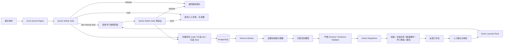
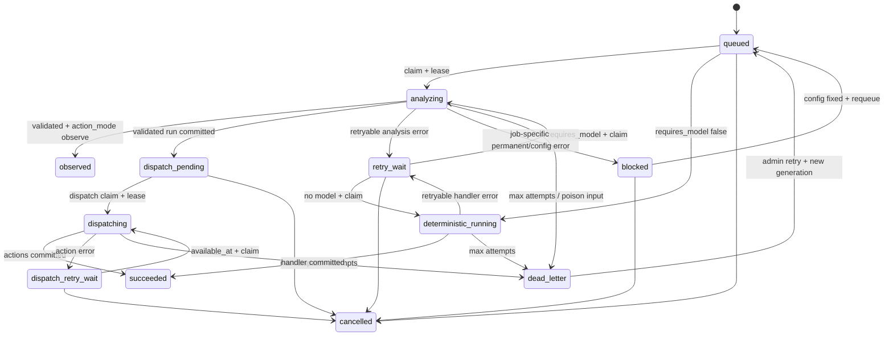

# Hermes Agent V2 可实施设计

状态：实施规格 v1.0（架构、后端、运营审查通过）  
适用系统：加拿大尾程自动报价模块  
设计目标：把当前“人工点击的只读诊断”升级为持续运行、可恢复、可审计、能形成运营闭环的 Hermes Agent，同时保持价格由确定性规则和人工授权控制。

## 1. 一句话结论

Hermes V2 不负责算价。它由三个明确分工的部分组成：

1. **Quote Safety Gate** 在报价返回前做确定性放行判断，证据不足就隐藏金额并转人工。
2. **Hermes Worker** 自动消费诊断任务、校验证据、调用模型、重试并记录每次运行。
3. **Action Dispatcher** 只执行白名单动作：完成诊断 Job、创建复核/事故 Case、创建数据质量事件、关联学习草案和写通知 outbox；永远不能改价、放行报价或发布规则。

这能解决当前最核心的两个问题：

- 类似 `L3K -> L3L` 的错误弱命中不会先把错误金额交给销售。
- Hermes 不再依靠人工逐票点击，模型建议也不再成为无人消费的 JSON。

## 2. “完全能用”的验收定义

只有同时满足以下条件，Hermes V2 才算上线完成：

- 高风险或证据不充分的报价在 API 返回前进入 `held_for_review`，客户金额为 `null`。
- 正常报价路径不依赖模型；模型停机、超时或未配置时，报价安全门仍然有效。
- 诊断任务由独立 Worker 自动领取，无需后台逐票点击。
- Worker 崩溃后租约到期可自动恢复；模型临时错误可退避重试；毒任务进入 dead letter。
- 相同报价和相同动作不会因重复入队或重试而重复创建人工任务。
- 每条模型结论必须引用诊断包内存在的 `evidence_id`，不能引用“常识”或生成包外金额。
- 每条成功诊断都有明确 `primary_disposition`：`no_action`、`review_created`、`data_issue_created` 或 `learning_review_completed`，并有逐条动作记录。
- 学习候选只来自结构化人工确认；模型不能直接生成可生效规则。
- held 报价只能通过 resolved Case 的 ManualQuoteReleaseService 形成新 revision，不能直接填金额改成 quoted。
- 已 released 报价若事后发现错误，必须通过 quote incident 生成 corrected revision 并跟踪销售联系，不能覆盖旧报价。
- 普通学习规则默认只能补充原始 `manual_required`，不能覆盖成功的 Zone Matrix 报价。
- 正式 Zone/价格导入必须产生可审批、可回滚 revision，任何旧写入口都不能绕过。
- 所有运行、重试、人工处理、审批、禁用和规则命中均可按 `quote_id` 追溯。
- 后台能看到 Worker 在线状态、队列深度、最老任务年龄、失败率、人工 SLA 和学习规则使用情况。

建议上线门槛：

| 指标 | 验收值 |
|---|---:|
| 确定性安全门额外 P95 延迟 | `< 50 ms` |
| P0 诊断任务开始处理 P95 | `< 60 s` |
| Worker 重启后的租约恢复 | `< 2 × lease_seconds` |
| 任务动作重复创建率 | `0` |
| 模型输出越权改价成功率 | `0` |
| `L3K / Port Colborne` 错误金额返回率 | `0` |
| 命中诊断策略的 Job 创建覆盖率 | `100%` |
| 风险回归语料 false release | `0` |
| dead letter 未告警时长 | `< 5 min` |
| active 规则禁用后的新命中数 | `0` |

## 3. 硬边界

### 3.1 Hermes 可以自动做

- 自动领取和分析诊断任务。
- 自动比较地址、Zone 命中、价格矩阵、已批准规则和精确人工历史。
- 自动标注严重度和问题类型。
- 自动创建或补充人工复核任务。
- 自动创建数据质量事件，例如“Zone 规则冲突”“价格矩阵缺行”“学习规则与正式矩阵冲突”。
- 在人工任务结构化解决后，触发确定性 Candidate Builder 生成待审核草案，并由 Agent 补充证据摘要。
- 自动发送企业微信或邮件告警。
- 自动生成日报和队列健康摘要。

### 3.2 Hermes 永远不能自动做

- 生成或修改报价金额。
- 修改 `zone_lookup_rules`、`postal_zone_overrides` 或 `zone_price_matrix`。
- 把 `held_for_review` 改成 `released`。
- 批准或发布学习规则。
- 根据“同邮编族”“字符距离”“地图看起来很近”推断 Zone 或金额。
- 使用模型输出覆盖确定性 Quote Engine 的价格。
- 向模型发送整张价格表、密钥、用户凭证或不必要的客户隐私数据。

## 4. 总体架构



设计选择：V2 使用 PostgreSQL 任务队列，不新增 Redis、Celery 或消息中间件。当前流量和部署规模下，`FOR UPDATE SKIP LOCKED`、租约和幂等动作已经足够，并能复用现有镜像与数据库。

V2 的必需运行时是仓库内 `hermes-worker + 已绑定 OpenAI-compatible 模型`，不依赖另行安装 NousResearch Hermes。以后若接入外部 Hermes runtime，也只能通过同一 Job/claim/evidence/action contract 以服务身份工作，不能获得 Shell、数据库价格表或规则发布权限。

## 5. 同步报价链路：Quote Safety Gate

### 5.1 调用顺序

```text
validate request
-> raw_result = ZoneQuoteEngine.quote()
-> quote_time_evidence = capture immutable rule/price/address/config references
-> raw_decision = QuoteSafetyGate.evaluate(request, raw_result, quote_time_evidence, policy)
-> if raw_decision is released: use raw_result and do not query learning prices
-> else if raw_result is manual_required: lookup approved learning rule and evaluate it through the same gate
-> else: keep held_for_review
-> mask price when held
-> one transaction: decision/audit + optional minimal diagnostic job + optional manual task + optional notification outbox
-> return response
```

模型不在此链路中。Safety Gate 必须是纯确定性函数，输入固定时输出固定，且拥有完整单元测试。`quote_time_evidence` 至少包含实际参与决策的地址记录版本、全部候选规则 ID/revision、选中规则、价格行 ID/revision 和 pricing config hash；Worker 后续读取的当前数据必须另标为 `current_evidence`，不能冒充报价时点证据。

### 5.2 新增返回字段

保留现有 `manual_review_required` 兼容旧客户端，并增加：

```json
{
  "release_status": "released | held_for_review | invalid",
  "release_reason_codes": ["unverified_city_fallback"],
  "price_locked": false,
  "customer_price_available": false,
  "review_task_id": 123,
  "diagnostic_job_id": null
}
```

规则：

- `released`：`manual_review_required=false`、`price_locked=true`、`customer_price_available=true`，金额可展示。
- `held_for_review`：`manual_review_required=true`、`customer_price_available=false`，所有客户金额字段必须为 `null`，复制客户回复按钮禁用。
- `invalid`：输入本身不满足报价条件，`customer_price_available=false`，不创建价格。
- 未命中诊断/抽样策略时 `diagnostic_job_id=null`；无需人工任务时 `review_task_id=null`。

后端提供唯一的 `mask_held_result()`，同时清空 `base_price_usd`、`fuel_usd`、`accessorials`、`total_price_usd`、含金额的 `sales_note/customer_reply` 和所有客户导出字段。复制、导出、邮件、企业微信和销售记录只能消费 masked final result；前端禁用按钮只是体验层，不是金额防泄漏的安全边界。

### 5.3 放行策略

可放行来源：

- 经验证的完整邮编 override，来源、有效期和审批人齐全。
- 精确 FSA + 省份下所有有效记录唯一指向同一 `origin + zone`。
- 精确 FSA + 规范城市 + 省份唯一命中，且不存在冲突记录。
- `trusted_city_anchor`，但必须同时满足地址库确认城市/省份、无邮编族推断、无冲突组。
- 已批准、未过期、条件完全一致的学习例外，且原始引擎结果是 `manual_required`。
- 对应 `origin + zone + billing_pallets` 的价格矩阵存在且在有效期内。

必须拦截的情形：

- FSA 未命中后借用同邮编族、字符相近或所谓“相邻 FSA”。
- 仅凭未验证的 city fallback 放价。
- 地址库城市/省份与输入或 Zone 规则冲突。
- 同一范围存在多个 `origin + zone`。
- Zone 命中但价格矩阵缺行或过期。
- 普通学习规则试图覆盖成功的正式 Zone Matrix 结果。
- 学习规则服务条件、托数、地址类型或附加服务不完全一致。
- 命中规则已禁用、过期、待复核或来源不可追溯。
- 出现 Safety Gate 尚未识别的新风险标签；未知风险默认拦截，只有版本化白名单可以放行。
- Safety Gate 自身发生异常。

当 Safety Gate 异常时默认 fail closed：返回 `held_for_review`，而不是放价。

Gate 维护版本化风险注册表，将现有 `appointment_required`、`residential` 等业务提示标为 advisory，将 fallback、conflict、stale、missing 等标为 blocker。新出现但未登记的 risk tag 一律按 blocker 处理。

同步事务只保存已经存在于内存中的请求、引擎结果、安全门结果和必要引用，不做历史扫描、地图请求、搜索或私有参考查询。当前 `_private_reference_context()` 会在报价请求内启动最长 2.5 秒的外部子进程；该 enrichment 必须整体移动到 Worker。否则即使模型异步，Hermes 仍会拖慢同步报价。

### 5.4 立即需要修正的现有行为

- 删除普通学习规则对成功 Zone Matrix 的 `match_score >= 100` 覆盖通道。
- `city_zone_prefix_family_fallback` 只能作为诊断线索，不能作为放价证据。
- 把 `neighboring_fsa` 全部改名为 `same_postal_family_references`，并标记 `can_support_zone=false`、`can_support_price=false`。
- 彻底移除或硬禁用未接线的同步 LLM 纠错服务，避免以后误接回主链。
- 人工任务只有在状态第一次从非 resolved 变为 resolved 且结论满足 exact exception 学习条件时生成候选。

## 6. 任务选择与优先级

并非每票报价都值得调用模型。入队策略如下：

| 优先级 | 场景 | 是否必跑模型 | SLA |
|---|---|---:|---:|
| P0 / 100 | 原引擎本想成功放价但被 Gate 因正式规则/学习规则冲突拦截，或已报价后发现高危事件 | 是 | 1 分钟 |
| P1 / 80 | 正常 `manual_required`、价格矩阵缺失、地址冲突 | 是 | 5 分钟 |
| P2 / 50 | 新学习规则前 20 次命中、规则刚变更 | 是 | 15 分钟 |
| P3 / 20 | 正常成功报价抽样 5% | 是 | 2 小时 |
| 定时 / 10 | 规则漂移、过期规则、队列日报 | 按任务类型 | 24 小时 |

抽样率、每日模型预算、P2 首次命中次数均可配置。超过预算时 P0/P1 继续处理，P2/P3 延后，不影响同步报价。

所有报价都写不可变 audit；只有命中诊断策略或稳定哈希抽样策略时才写 Job。若一票命中多条策略，取最高优先级并通过 dedupe key 只创建一个主 Job。

Case 的默认人工 SLA 与 Job SLA 分开计算：

| 级别 | 首次领取/确认 | 处理目标 |
|---|---:|---:|
| P0 | 5 分钟 | 15 分钟内止损并联系相关销售 |
| P1 | 15 分钟 | 60 分钟内解决或转 `waiting_external` |
| P2 | 4 小时 | 1 个工作日 |
| P3 | 1 个工作日 | 3 个工作日 |

首次成功 claim/assigned 写 `acknowledged_at`，第一次实质处理写 `first_response_at`；`waiting_external` 暂停内部解决计时但保留外部等待时长。

## 7. Worker 运行时

### 7.1 任务状态机



`status` 只表示运行状态；业务主结论单独保存在 `primary_disposition`：

- `no_action`
- `review_created`
- `data_issue_created`
- `learning_review_completed`

一个 Job 可以产生多条动作，因此具体动作必须逐行写入 `hermes_actions`。通知是否送达只属于 notification outbox 状态，不是 Job 的业务结论。

每个 Job 在创建时固化 `action_mode=observe|active`。Observe Job 保存 validated run 后直接进入终态 `observed`，永远不会因为以后打开动作开关而补执行旧建议；若确需执行，admin 必须以新 generation 明确重跑并选择 active mode。

### 7.2 Claim 算法

领取任务必须在短事务中完成：

```sql
SELECT id
FROM hermes_jobs
WHERE status IN ('queued', 'retry_wait')
  AND requires_model = true
  AND available_at <= now()
ORDER BY priority DESC, available_at ASC, id ASC
FOR UPDATE SKIP LOCKED
LIMIT 1;
```

随后原子更新：

- `status='analyzing'`
- `claim_token=<new uuid>`
- `lease_owner=<worker_id>`
- `effective_lease_seconds=max(base_lease_seconds, model_timeout_seconds+60)`
- `lease_expires_at=now()+effective_lease_seconds`
- `attempt_count=attempt_count+1`
- `started_at=coalesce(started_at, now())`

领取事务提交后立即释放数据库行锁，模型调用期间不得持锁。Worker 使用 at-least-once 处理；通过任务 `dedupe_key`、动作 `idempotency_key` 和 `claim_token` CAS 实现业务效果不重复。完成分析时必须执行 `WHERE id=:id AND claim_token=:token AND status='analyzing'`，避免旧 Worker 在租约被回收后覆盖新 Worker 的结果。

Dispatch claim 使用同样的短事务和 `SKIP LOCKED`，但只选择 `dispatch_pending/dispatch_retry_wait`，不读取模型预算也不调用 provider；它拥有独立的 `dispatch_attempt_count`。

`requires_model=false` 的 alert、日报和确定性 drift 使用独立 claim loop，状态为 `deterministic_running -> succeeded/retry_wait/dead_letter`，不写 `hermes_agent_runs`，也不受模型 readiness、模型预算或 `HERMES_ACTIONS_ENABLED` 影响。模型 readiness 和 `hermes_budget_buckets` 只约束 `requires_model=true`；预算耗尽时 P2/P3 延后，P0/P1 使用单独的保留额度继续处理。

每轮 claim 前先执行原子 lease reaper：

- `analyzing + lease_expires_at < now()`：未到上限转 `retry_wait`，到上限转 `dead_letter`；对应 run 标为 `lease_lost`。
- `deterministic_running + lease_expires_at < now()`：未到上限转 `retry_wait`，到上限转 `dead_letter`。
- `dispatching + lease_expires_at < now()`：未到上限转 `dispatch_retry_wait`，到上限转 `dead_letter`。
- 回收时清空旧 `claim_token/lease_owner`；旧 Worker 后续 CAS 必须失败。

管理员重跑 dead letter 时执行 `run_generation += 1`、`attempt_count=0`、`dispatch_attempt_count=0`。Run 唯一键使用 `(job_id, run_generation, attempt_no)`，不会与历史尝试冲突。

### 7.3 重试策略

- HTTP 429、超时、5xx：指数退避加抖动，建议 `30s, 2m, 10m, 30m, 2h`。
- 模型返回非法 JSON：进入下一次 retry attempt，并使用 repair prompt；每次 provider call 都单独记录一条 run。
- Worker 在领取需要模型的 `quote_diagnostic/learning_review` 前检查 Hermes 专属模型 readiness；未配置时不领取这些任务，它们保持 queued，后台显示模型子系统 blocked。`alert_evaluation`、notification outbox、纯确定性 drift 和健康日报继续运行。已 claim 后发现 401/403、模型权限或 job schema 不兼容时才将该 job 标为 `blocked`，且本次 attempt 保留。
- 证据包损坏或 schema_version 不支持：直接 dead letter，并创建数据质量告警。
- Worker 进程退出：租约超时后由其他 Worker 重新领取。
- 模型校验成功后，第一笔短事务保存不可变 run 并把 job 置为 `dispatch_pending`。
- 第二笔事务幂等写 `hermes_actions`、人工任务、事件和 notification outbox，再把 job 置为 `succeeded`。动作失败只回滚第二笔事务并进入 `dispatch_retry_wait`，不得再次调用模型。
- 第二笔动作事务失败并回滚后，catch 必须开启第三笔短事务：用 claim token CAS 记录 dispatch error、退避时间和 `dispatch_retry_wait`。第三笔也失败时不做无锁补写，交给 lease reaper 恢复。
- 模型配置保存且契约测试成功后，系统批量 requeue 相同 `blocked_reason` 的 jobs；同时保留 admin 手工批量恢复入口。

### 7.4 Worker 心跳

独立 heartbeat thread/async task 每 10 秒更新一次，不能被同步模型请求阻塞：

- `worker_id`
- `version`
- `started_at`
- `last_seen_at`
- `status`
- `current_job_id`

API 将 30 秒内无心跳视为离线。心跳不能只依靠“最近处理任务”，否则空闲 Worker 会被误判为离线。

Worker 还要每 `effective_lease_seconds / 3` 用 claim token CAS 续租。基础 lease 默认 600 秒；实际 lease 在 claim 时按模型 timeout 动态计算，不依赖 API 容器读取 Worker 环境变量。

定时任务由 hermes monitor 的 scheduler loop 使用 PostgreSQL advisory lock + 时间桶 dedupe key 入队，例如 `daily_report:2026-07-10`；多个 monitor 短暂重叠也只产生一条任务，不依赖仓库外 cron。

## 8. 诊断证据包 V2

当前诊断包把事实、弱参考和推测混在一起。V2 必须为每条证据标注权威等级和用途。

```json
{
  "schema_version": "hermes-diagnostic.v2",
  "quote_id": "zone_xxx",
  "trace_id": "...",
  "request_snapshot": {},
  "engine_result": {},
  "release_decision": {},
  "evidence": [
    {
      "evidence_id": "postal_lookup:ABC",
      "kind": "postal_authority",
      "trust_level": "authoritative",
      "observed_at": "2026-07-10T00:00:00Z",
      "can_support_zone": false,
      "can_support_price": false,
      "payload": {}
    }
  ],
  "signals": [],
  "allowed_actions": [
    "no_action",
    "create_review_task",
    "create_data_issue",
    "review_learning_candidate",
    "notify_operator"
  ]
}
```

`allowed_actions` 按 job kind 动态生成，不是所有任务都拥有全部动作。初始 `quote_diagnostic` 通常只允许 `no_action/create_review_task/create_data_issue/notify_operator`；只有已经关联 candidate 的 `learning_review` 才允许 `review_learning_candidate`。

证据等级：

| 等级 | 示例 | 可证明 Zone | 可证明金额 |
|---|---|---:|---:|
| authoritative | 已审批完整邮编 override、正式 Zone 规则、正式价格矩阵 | 按记录能力 | 按记录能力 |
| verified_human | 带供应商/合同凭据的人工确认 | 限确认范围 | 限确认范围 |
| contextual | 精确地址库、同地址历史 | 仅辅助 | 否 |
| signal_only | 同邮编族、价格离群、地图视觉、普通相似历史 | 否 | 否 |

任何 `signal_only` 都只能触发复核，不能支持 `suggested_zone` 或 `suggested_price`。

隐私和最小化：

- 模型不接收姓名、电话、邮箱、登录信息和 API Key。
- `raw_input` 先做电话、邮箱和账号脱敏；默认不向模型发送完整地址门牌，只发送规范化邮编、城市、省份和必要地址类型。
- 不向模型发送完整价格表，只发送本次精确命中行和有限冲突摘要。
- 诊断包和模型响应默认保留 90 天；价格审计按业务审计策略保留。
- 日志只记录 `job_id/quote_id/error_code`，不打印诊断包正文。

## 9. 模型输出契约

使用 Pydantic `extra='forbid'` 的严格 Schema：

```json
{
  "schema_version": "hermes-suggestion.v2",
  "disposition": "no_action | open_review | data_quality_issue | learning_review",
  "severity": "info | low | medium | high | critical",
  "confidence": 0,
  "summary_zh": "",
  "findings": [
    {
      "code": "zone_rule_conflict",
      "claim_zh": "",
      "evidence_ids": ["..."],
      "confidence": 0
    }
  ],
  "recommended_actions": [
    {
      "type": "create_review_task",
      "reason_code": "zone_rule_conflict",
      "evidence_ids": ["..."]
    }
  ]
}
```

服务端校验：

- 所有 evidence ID 必须在输入包中存在。
- 动作必须出现在该任务的 `allowed_actions`。
- 输出出现输入包外金额时整条响应无效。
- `signal_only` 证据不能支持 Zone 或价格结论。
- `confidence` 不改变 Safety Gate 决策。
- `learning_review` 必须关联一个已解决任务和已存在候选；缺少任一对象时输出无效，不能由 Agent 补造候选。
- 模型输出中的自由文本永远不直接拼接进客户报价。

金额检查复用现有 AI output guard：模型输出 schema 不提供金额字段，并扫描自由文本中的货币金额；只允许诊断包明确列入 allowlist 的金额被原样引用，任何新金额都会使响应无效。

## 10. Action Dispatcher

模型没有数据库写权限。Dispatcher 将已验证输出映射到白名单服务方法。

| Agent disposition | 实际动作 | 幂等键 |
|---|---|---|
| `no_action` | 只完成诊断 Job 并记录原因；不得关闭或解决已有人工任务 | `job:{id}:no_action` |
| `open_review` | 创建或补充人工任务并通知 | `quote:{quote_id}:revision:{revision_id}:quote_review:{reason_code}` |
| `data_quality_issue` | 创建数据质量类型人工任务 | `quote:{quote_id}:revision:{revision_id}:data_issue:{reason_code}` |
| `learning_review` | 关联并补充 Resolution Service 已幂等创建的 pending_review 草案 | `task:{task_id}:resolution:{version}` |

模型 run 与动作分两阶段提交：先独立保存不可变 validated run 并置 `dispatch_pending`；再在第二笔事务中写 `hermes_actions`、人工任务/事故、operation events、notification outbox 和 Job succeeded。重试时若幂等动作已存在，则复用已有记录并完成 Job，绝不重复调用模型。

## 11. 数据模型与迁移 0017–0019

为降低回滚风险，分为三次迁移：`0017` 建报价安全审计、最小人工 release、operation events、notification outbox、正式数据 provenance、通用 Job、run 和 heartbeat；`0018` 建动作、完整 Case/SLA、alerts/monitor 及事故链接；`0019` 建学习证据、data change request、规则版本和完整性约束。

### 11.1 新建通用 `hermes_jobs`

现有 `hermes_diagnostic_queue` 的必填字段全部面向报价，不能可靠承载日报、漂移和学习任务。0017 新建通用 `hermes_jobs`，复制历史记录后把旧表保留为只读 legacy 一次发布周期，兼容 API 改为读取新表。

主要字段：

- `subject_type`, `subject_id`：`quote | manual_task | learning_candidate | rule | system`。
- `quote_id`：可空的搜索冗余字段。
- `job_kind`: `quote_diagnostic | learning_review | rule_drift | alert_evaluation | daily_report`。
- `status`, `primary_disposition`, `priority`, `requires_model`, `action_mode`。
- `payload_json`, `payload_schema_version`, `payload_sha256`。
- `dedupe_key`：唯一。
- `run_generation`, `attempt_count`, `max_attempts`。
- `dispatch_attempt_count`, `max_dispatch_attempts`。
- `available_at`, `claim_token`, `lease_owner`, `lease_expires_at`。
- `started_at`, `finished_at`, `blocked_reason`, `last_error_code`。
- `prompt_version`, `model_config_id`（FK `ON DELETE SET NULL`）。
- `trace_id`, `row_version`, `created_at`, `updated_at`。

允许的 status 固定为：`queued/analyzing/deterministic_running/retry_wait/observed/dispatch_pending/dispatching/dispatch_retry_wait/succeeded/blocked/dead_letter/cancelled`。

dedupe key 必须包含任务语义版本，不能只用 quote ID：

- Quote：`{job_kind}:quote:{quote_id}:revision:{revision_id}:policy:{policy_version}:schema:{schema_version}`。
- Learning：`learning_review:candidate:{candidate_id}:version:{candidate_version}:schema:{schema_version}`。
- Rule/system：`{job_kind}:{subject_id}:{subject_revision}:{time_bucket}`。

同 revision 重试复用原 Job；新 quote/rule revision 必然产生新 key。

历史状态映射：`pending -> queued`、`completed -> succeeded`、`failed -> dead_letter`；旧建议保存在迁移后的 payload/result 快照中。旧行 `run_generation=1`、`row_version=1`，dedupe key 回填为 `legacy:{old_id}`。

先清洗重复历史数据再建立唯一索引。Ready queue 使用部分索引：

```sql
CREATE INDEX ix_hermes_jobs_ready
ON hermes_jobs (priority DESC, available_at ASC, id ASC)
WHERE status IN ('queued', 'retry_wait', 'dispatch_pending', 'dispatch_retry_wait');
```

另建过期 lease、quote_id 和 dedupe key 索引。

### 11.2 新增 `hermes_agent_runs`

每次 provider 调用一行，不能被后续重试覆盖：

- `job_id`, `run_generation`, `attempt_no`, `claim_token`, `worker_id`。
- `model_config_id`（`ON DELETE SET NULL`）、provider/model snapshot。
- `prompt_version`, `prompt_kind`, `input_hash`。
- `raw_response_json`, `validated_response_json`, `validation_errors_json`。
- `latency_ms`, `input_tokens`, `output_tokens`, `provider_request_id`。
- `status`, `error_code`, `error_message`, `started_at`, `finished_at`。

唯一约束：`(job_id, run_generation, attempt_no)` 和 `claim_token`。

### 11.3 新增 `hermes_worker_heartbeats`

- `worker_id` 主键。
- `version`, `status`, `current_job_id`。
- `started_at`, `last_seen_at`, `metadata_json`。

### 11.4 新增 `hermes_actions`

一个 Job 可产生多条动作；动作状态不能用 operation event 代替：

- `job_id`, `action_type`。
- `idempotency_key` unique。
- `status`: `proposed | applied | failed | cancelled`。
- `payload_json`, `target_entity_type`, `target_entity_id`。
- `error`, `created_at`, `applied_at`。

另建 append-only `hermes_dispatch_runs`，记录 `job_id/run_generation/dispatch_attempt_no/claim_token/status/error/started_at/finished_at`；唯一 `(job_id, run_generation, dispatch_attempt_no)`。成功记录与 actions 同事务，失败记录由第三笔 CAS failure transaction 写入。

### 11.5 扩展 `manual_quote_tasks`，并把它定义为运营 Case

V2 的 Case Inbox 以扩展后的 `manual_quote_tasks` 为唯一 Case 数据源，不再额外创造同义 Case 表。Job 与 Case 通过 `hermes_actions.target_entity_type='manual_task'` 关联。

- `task_type`: `quote_review | data_quality | quote_incident`。
- `source`, `task_key` unique。
- `source_job_id` 可空；后续 Job/Case 多对多关系由 `hermes_actions` 表达。
- `source_quote_revision_id` 可空，用于 post-release incident 精确定位当时结果和接收人。
- `severity`, `due_at`, `acknowledged_at`, `first_response_at`。
- `delivery_status`: `release_not_required | release_required | released | release_failed | correction_required | corrected | correction_failed`。
- `released_revision_id`, `corrected_revision_id`。
- `resolution_code`, `resolution_evidence_type`, `resolution_evidence_ref`。
- `confirmed_origin`, `confirmed_zone`。
- `resolved_base_price_usd`, `price_breakdown_json`。
- `effective_from`, `effective_to`, `resolved_by`, `resolved_at`。
- `resolution_version`, `row_version`。

其中本票释放所需的 `task_type/source_quote_revision/delivery status/resolution/evidence/price components/effective dates/resolved actor/version` 在 0017 先落地；`source_job/severity/SLA/job-action links` 在 0018 补齐。这样 Phase 1 启用 Gate 前，人工确认报价已有安全交付路径。

未关闭任务的部分唯一约束为 `(quote_id, task_type) WHERE status IN ('pending','assigned','in_review','waiting_external','resolved_pending_release','resolved_pending_correction')`。历史 `in_progress -> in_review`，其他现有状态保持语义映射，`row_version=1`。

Hermes 创建的 task key 使用 `quote:{quote_id}:revision:{revision_id}:{task_type}:{reason_code}`；同 revision 重试复用，新的 quote revision 可以创建新的合法 Case。

异步发现已 released 报价疑似有误时创建 `quote_incident` Case，关联具体 quote revision，把关联 `sales_quote_record/quote revision follow-up status` 标为 `needs_followup`，根据 revision actor 通知原销售，并记录 `acknowledged/customer_contacted/corrected/closed` 时间线；系统不静默改写或撤回原报价。需要更正金额时 Case 进入 `resolved_pending_correction + correction_required`，只有新的 corrected revision 成功后才能标记 corrected/closed。

### 11.6 学习候选、正式变更和规则

`hermes_learning_candidates` 只承载 `exact_quote_exception`：

- `source_job_id`, `source_task_id`, `resolution_version`。
- `validation_status`, `simulation_json`, `condition_fingerprint`。
- `price_basis`, `currency`, `price_components_json`, `pricing_config_hash`。
- `valid_from`, `valid_until`。
- unique `(source_task_id, resolution_version, condition_fingerprint)`。

`learned_quote_rules` 增加：

- `source_candidate_id`, `rule_kind='exact_quote_exception'`。
- `condition_fingerprint`, `price_basis`, `currency`, `price_components_json`, `pricing_config_hash`。
- `approved_by/at`, `activated_by/at`。
- `valid_from/until`, `revision`, `superseded_by_rule_id`。
- `last_verified_at`, `disabled_reason`, 规范化 `rule_key` unique。

Zone mapping 和矩阵缺行不进入 learned rule。新增 `data_change_requests`：

- `change_type`: `zone_mapping | zone_price_matrix`。
- `source_task_id`, `source_job_id`, `proposed_patch_json`, `simulation_json`。
- `status`: `proposed -> approved -> applied -> verified/rolled_back`，或 `rejected`。
- `reviewed_by/at`, `applied_by/at`, `target_revision`, `rollback_revision`。

只有 admin 能在 dry-run 后通过正式数据维护服务应用变更；每次 apply 生成新 revision 并可回滚，Hermes 只创建 proposal。

### 11.7 学习证据、事件、通知、告警和预算

`hermes_learning_candidate_evidence`：

- `candidate_id`, `manual_task_id`, `resolution_version`。
- `evidence_type`, `evidence_ref`, `evidence_hash`。
- `confirmed_at`, `confirmed_by`。
- unique `(candidate_id, manual_task_id, resolution_version)`。

候选 `support_count` 从独立 evidence 行实时计算或由数据库维护，不允许业务代码直接 `support_count += 1`。

`operation_events` 在 0017 先建立，只追加记录 `trace_id/quote_id`、entity、event、actor、before/after、metadata 和时间。

`notification_outbox` 在 0017 先建立，包含 `idempotency_key`、channel、payload、status、attempts、available_at、claim token/lease、last_error、sent_at；由独立 notification worker 做 claim、退避、dead letter 和幂等发送。

`hermes_alerts` 包含 dedupe key、severity、状态 `active/acknowledged/silenced/resolved`、首次/最近触发、确认/静默/恢复信息。独立 hermes monitor 的无模型 `alert_evaluation` scheduler 定期评估指标并写 alerts/outbox。

`hermes_budget_buckets` 以日期 + 模型为唯一键，通过数据库原子计数执行所有 Worker 共享的每日预算；不得把环境变量额度按 Worker 各自计算。

### 11.8 扩展报价审计

`quote_audit_logs` 增加：

- `engine_candidate_json`, `final_result_json`。
- `release_status`, `release_reason_codes`, `gate_policy_version`。
- `pricing_config_hash`。
- `quote_time_evidence_json`, `evidence_snapshot_hash`。
- `trace_id`。
- `actor_user_id/api_key_id/name/role`, `request_channel`。

最终客户结果与内部候选结果分开保存。同步链路保存最小不可变证据 payload 或不可变 revision 引用，不能只存 hash；Worker 的 `current_evidence` 另外保存。

新增 append-only `quote_revisions`，每次系统或人工向调用方形成新结果都写一行：

- `quote_id`, `revision_no`, `previous_revision_id`。
- `release_type`: `engine_released | held_for_review | released_by_human | corrected_by_human`。
- `followup_status`: `normal | needs_followup | contacted | corrected | closed`。
- `source_case_id`, `request_json`, `result_json`, `customer_reply`。
- `actor_user_id/api_key_id/name/role`, `request_channel`。
- `evidence_hash`, `created_at`。

唯一 `(quote_id, revision_no)` 以及人工 release 的 `(source_case_id, source_resolution_version, release_type)`；原始 revision 永不覆盖。所有普通 Zone 和 AI 报价入口都必须通过 Orchestrator 在同一事务写 actor/revision，不能再让 sales record 成为可选的 best-effort 副作用。

### 11.9 正式数据的来源、有效期、revision 与 backfill（0017）

Safety Gate 要验证“数据可信且未过期”，正式表增加：

- `zone_lookup_rules`：`source_revision`、`trust_level`、`effective_from/to`、`verified_by/at`。
- `postal_zone_overrides`：`approved_by/at`、`effective_from/to`、`source_hash`。
- `zone_price_matrix`：`active`、`import_batch_id`、`source_hash`、`effective_from/to`、`approved_by/at`。

新增 append-only `zone_rule_revisions`、`postal_override_revisions`、`zone_price_matrix_revisions`、`quote_rule_config_revisions`、`postal_city_lookup_revisions` 和 `city_alias_revisions`。现有业务表作为当前 active projection；FormalDataMaintenance Service 每次 apply 先写 revision，再在同一事务更新 projection。回滚从历史 revision 恢复为新 revision，永不原地删除历史。每个业务键只允许一个 active revision。

当前 `last_updated` 自由文本不足以作为有效期判断。迁移先对现有数据生成 legacy import batch 和 checksum，再由 admin 一次性复核/签署；Gate 先以 shadow 方式记录决定，签署完成后才启用严格 provenance 拦截。未签署数据保持人工复核，不能自动视为权威。

现有 Excel/后台写入口不得直接 upsert projection：Phase 1 的 Zone、价格、燃油/附加费配置、邮编城市库和城市别名变更都先创建 staged revision，完成校验、dry-run 和 admin 签署后才 apply；0019 上线后再关联完整 data change request。正式表的 DB UPDATE 权限只授予 FormalDataMaintenance 使用的独立角色，未签署 revision 一律是 Gate blocker。

### 11.10 Legacy learned rules 隔离

0017 启用 Gate 前，把所有现有 active learned rules 统一转为 `needs_reconciliation/suspended`，不自动补造 price basis、components、有效期或证据。重新激活必须满足数据库 CHECK：完整六位邮编、exact scope、完整 condition fingerprint、可复算价格构成、证据和有效期齐全。旧 FSA/城市级 learned rule 永远不能直接迁移为 active exact exception。

### 11.11 迁移清洗要求

- 0017 先复制 legacy jobs、校验数量和 payload hash，再切换 API 读取；禁止直接丢旧表。
- 0018 建 open-task 唯一索引前，按 `quote_id + task_type` 合并重复未关闭任务，并把冲突写入 operation event。
- 0019 从不同 `source_task_id` 回填独立 evidence；同一候选若存在冲突价格，状态置 `needs_reconciliation`，不得自动取最后一条。
- 建 `rule_key/condition_fingerprint` 唯一约束前先生成冲突报告，由 admin 选择保留、supersede 或禁用。
- 状态字段使用字符串 + CHECK constraint，不使用 PostgreSQL enum，以保留现有 SQLite 单元测试兼容性。

## 12. 人工处理与安全学习

### 12.1 人工任务必须结构化解决

`resolved` 时必须提交：

- `resolution_code`
- `resolved_price_usd`（若该结论含价格）
- `resolution_evidence_type`
- `resolution_evidence_ref`
- `resolved_note`
- `confirmed_origin/confirmed_zone`（当结论涉及分区时）
- `resolved_base_price_usd/price_breakdown`（当结论涉及价格时）
- `effective_from/effective_to`（当结论可复用时）
- `price_basis`: `all_in_locked | base_plus_current_surcharges`（当结论可复用时）
- `currency` 和可复算的 `price_components`。

建议 resolution code：

- `supplier_confirmed`
- `contract_confirmed`
- `matrix_updated`
- `one_off_exception`
- `invalid_request`
- `duplicate`
- `unable_to_verify`

只有 `supplier_confirmed` 或 `contract_confirmed` 且明确标记“可复用 exact exception”时才能生成学习候选。`matrix_updated` 由正式数据本身解决未来报价，不再生成 learned rule；`one_off_exception` 永远不学习。条件指纹至少包含托数、地址类型、尾板、手叉、预约、等待、包装/堆叠、超长条件和费率配置版本。

候选只在 Case 真正进入终态 `resolved` 时创建。`ManualTaskResolutionService` 是唯一创建者：同一事务更新任务、写 evidence/candidate/operation event，并入队 `learning_review`；任何一步失败全部回滚。Dispatcher 只能通过同一个幂等 `ensure_candidate()` 关联已有候选，不能实现第二套创建逻辑。重复 PATCH 同一 resolved 任务只更新备注，不增加 support_count，也不重复建候选。

Resolution Service 按结论分流：可复用 exact exception 创建 candidate；Zone mapping/矩阵问题创建 `data_change_request`；一次性、无问题、无效请求等只关闭 Case，不创建任何学习对象。

人工任务状态只允许：`pending -> assigned -> in_review -> waiting_external -> resolved_pending_release/resolved_pending_correction -> resolved`，其中 correction revision 成功后可回到 `waiting_external` 等待销售确认客户联系；任一未关闭状态也可按权限转 `cancelled`。含可交付价格的 quote review 先进入 `resolved_pending_release + release_required`；需更正的 incident 进入 `resolved_pending_correction + correction_required`，二者继续计算人工 SLA，只有对应 revision 成功且所需跟进完成后才进入 resolved。`invalid_request/duplicate/unable_to_verify` 等无报价结论可直接进入 `resolved + release_not_required`。所有迁移由后端校验并写 `operation_events`；更新必须提交 `row_version`，并发冲突返回 409。

任务 resolved 后由确定性 Candidate Builder 处理：可复用结论先幂等创建候选和 `hermes_learning_candidate_evidence`，再入队一条 `learning_review` job 做证据摘要、冲突说明和 dry-run 建议。初始 `quote_diagnostic` job 没有关联 resolved 任务和 candidate 时，不允许 `learning_review`；这避免“建议学习”发生在人工事实确认之前。

### 12.2 学习范围

- 一次可靠人工确认：最多生成“完整邮编 + 精确服务条件 + 精确托数”的短期例外。
- FSA + 城市、Zone mapping、矩阵缺行：只生成 `data_change_request`，即使有多次证据也必须进入正式数据维护。
- 省级、城市级或跨托数价格扩展：禁止由 Hermes 学习。
- 默认有效期 90 天；合同有明确有效期时跟随合同。

价格语义必须明确：

- `all_in_locked`：保存 base、fuel、每项 accessorial、total、币种和舍入规则；Gate 验证 components 之和等于 total，规则有效期内按整套快照复用。
- `base_plus_current_surcharges`：只锁定已确认 base，燃油和附加费由当前确定性 pricing config 重新计算；审计同时记录候选和当前 config hash。
- 任一模式缺少构成、币种、公式版本或条件指纹时不得激活。

### 12.3 批准前模拟

每次批准前运行 dry-run：

- 扫描最近审计记录，计算会命中的报价数量。
- 列出会与正常 Zone Matrix 冲突的记录。
- 比较金额差异和服务条件差异。
- 普通学习规则只要会覆盖正常 Matrix，审批按钮就被阻止。
- 展示范围、有效期、证据次数和一键回滚目标。

只有 `exact_quote_exception` 的候选批准会创建 `shadow` learned rule；mapping/matrix proposal 转入 `data_change_requests`。Shadow 激活门槛：凭据通过、dry-run 对正常 Matrix 冲突为 0、condition fingerprint 完整、有效期不超过 90 天。完整邮编例外可能没有自然 shadow 命中，因此 admin 可填写强制 activation reason 激活；之后前 20 次命中全部进入 P2 监控。

默认 maker-checker：任务 resolver 不能是 candidate approver；rule activator 不能是 resolver。`HERMES_STRICT_FOUR_EYES=true` 时还要求 approver 与 activator 不同。规则状态为 `shadow -> active -> suspended/expired/superseded`；禁用规则保留审计记录，不物理删除。

### 12.4 本票人工放行

人工解决 Case 后必须能交付本票，但不能继续使用现有“直接填金额 + 任意 customer_reply”的旁路。新增唯一 `ManualQuoteReleaseService`：

1. 只接受 `resolved_pending_release + release_required`、证据完整的 Case 和最新 `row_version`；也提供原子“解决并放行”操作。
2. 按结构化 price basis/components 重建本票结果，并再次执行人工放行策略校验。
3. 客户话术由服务端模板生成；如允许编辑，只能编辑非金额文本，现有 output guard 必须确认所有货币数字都来自最终结果 allowlist。
4. 同一事务写 `quote_revisions(released_by_human)`、把 Case 置为 `resolved + released`、更新关联销售/交付状态、写 operation event 和 notification outbox。
5. 返回新的 revision；复制、导出和通知只能读取最新 released revision。

强绑定约束：Case 必须是 `task_type=quote_review`，并关联当前最新 `held_for_review` revision；Case 的 quote ID、request fingerprint 和 cargo/condition fingerprint 必须与该 revision 完全一致。事务内 `FOR UPDATE` 锁定 Case 和最新 revision；若已经存在更新的 released/corrected revision，旧 Case 禁止再释放。release idempotency key 为 `case:{task_id}:resolution:{resolution_version}:release`，数据库唯一 `(source_case_id, resolution_version, release_type)`；重复请求返回已有 revision，不重复写通知。

新增 `POST /quotes/manual-tasks/{task_id}/resolve-and-release`（推荐原子路径）和 `POST /quotes/manual-tasks/{task_id}/release`（恢复 `resolved_pending_release`）。现有 `/sales-records/{id}/manual-price` 和 `/sales-records/by-quote/{quote_id}/manual-price` 在兼容期必须委托该 Service，并强制提交 task ID；随后删除，不能保留绕过 Case、证据和 Safety Gate 的写入口。

### 12.5 已报价事故更正

`QuoteIncidentCorrectionService` 与本票 release 严格分离：

1. 只接受证据完整的 `task_type=quote_incident + resolved_pending_correction + correction_required`。
2. Case 必须绑定原 `engine_released/released_by_human` revision；事务内锁定 Case、源 revision 和当前最新客户可见 revision。存在更新 revision 时拒绝旧事故再次更正，或返回已有幂等结果。
3. 按结构化价格构成生成新的 `corrected_by_human` revision；客户更正话术由服务端模板和金额 allowlist 产生，旧 revision 永不覆盖。
4. 幂等键为 `incident:{task_id}:resolution:{resolution_version}:correct`，唯一 `(source_case_id, resolution_version, release_type='corrected_by_human')`。
5. revision 成功后把 follow-up 标为 `corrected` 并通知原销售；Case 转 `waiting_external`，销售确认“客户已联系”或“原报价未发送”后才进入 `resolved/closed`。

这样 Hermes 仍不能自行撤回或改价，但运营可以在同一系统内生成可审计的纠正版并完成客户止损闭环。

## 13. API 设计

### 13.1 运行健康

- `GET /quotes/hermes/health`
  - Worker 在线数、最后心跳、模型配置状态、队列深度、最老任务年龄、dead letter 数。
- `GET /quotes/hermes/metrics?window=24h`
  - 运行成功率、延迟、模型错误、动作数量、人工 SLA、规则命中和禁用。

主 `/health` 只表示报价 API 的 liveness/readiness；Hermes 模型故障不会让容器被误重启。`/quotes/hermes/health` 单独返回 `healthy/degraded/unavailable/paused` 及原因。

### 13.2 任务管理

- `GET /quotes/hermes/jobs`
- `GET /quotes/hermes/jobs/{job_id}`
- `POST /quotes/hermes/jobs/{job_id}/retry`（admin）
- `POST /quotes/hermes/jobs/{job_id}/cancel`（admin）
- `POST /quotes/hermes/jobs/{job_id}/requeue`（blocked/dead letter，admin）
- `POST /quotes/hermes/jobs/bulk-requeue`（按 blocked reason/config 批量恢复，admin）

正常用户不再需要“运行 Hermes”按钮；该按钮改为 admin 的“重试任务”。旧 `/hermes-diagnostics/{id}/run` 在兼容期只做异步 requeue 并返回 HTTP 202，不能同步调用模型。

### 13.3 人工任务和学习

- `GET /quotes/manual-tasks`：Case Inbox cursor pagination、全局 counters 和 SLA filters。
- `POST /quotes/manual-tasks/{task_id}/claim`
- `POST /quotes/manual-tasks/{task_id}/reassign`
- `POST /quotes/manual-tasks/{task_id}/transition`
- `POST /quotes/manual-tasks/{task_id}/reopen`
- `PATCH /quotes/manual-tasks/{task_id}`：结构化 resolution 和 `row_version`。
- `POST /quotes/manual-tasks/{task_id}/resolve-and-release`：原子保存结论并生成客户 revision。
- `POST /quotes/manual-tasks/{task_id}/release`：生成不可变 `released_by_human` quote revision。
- `POST /quotes/manual-tasks/{task_id}/resolve-and-correct`：原子保存事故结论并生成纠正版 revision。
- `POST /quotes/manual-tasks/{task_id}/correct`：恢复 `resolved_pending_correction`。
- `POST /quotes/manual-tasks/{task_id}/confirm-followup`：确认已联系客户/原报价未发送并关闭事故。
- `GET /quotes/{quote_id}/revisions`
- `POST /quotes/learning-candidates/{id}/simulate`
- `POST /quotes/learning-candidates/{id}/approve`
- `POST /quotes/learning-candidates/{id}/reject`
- `POST /quotes/learned-rules/{id}/activate`
- `POST /quotes/learned-rules/{id}/suspend`
- `POST /quotes/learned-rules/{id}/restore`
- `POST /quotes/data-change-requests/{id}/simulate`
- `POST /quotes/data-change-requests/{id}/approve`
- `POST /quotes/data-change-requests/{id}/apply`
- `POST /quotes/data-change-requests/{id}/verify`
- `POST /quotes/data-change-requests/{id}/rollback`
- `GET /quotes/hermes/alerts`
- `POST /quotes/hermes/alerts/{id}/acknowledge`
- `POST /quotes/hermes/alerts/{id}/silence`

所有写接口返回完整 actor、时间、旧值、新值和审计事件 ID。

列表接口必须使用服务端 cursor pagination，并返回数据库全局 counters；页面不能再用当前 50/80 条结果计算队列总数。

## 14. 运营工作台

把当前分散页面收敛为一个 Hermes Command Center。界面中的“Case”就是扩展后的 `manual_quote_tasks`，不是另一套隐藏数据模型。

### 14.1 顶部健康栏

- Worker：在线/离线、版本、最后心跳。
- 模型：已绑定/未绑定、最近测试、最近成功调用。
- 队列：P0/P1 数量、最老任务年龄、analyzing、observed、dispatch pending/retry、blocked、dead letter。
- 运营：待复核数量、超 SLA 数量、待审学习候选。

Hermes 必须显式绑定专用模型，不回退到通用 AI 报价模型。模型切换采用“固定诊断包契约测试 -> canary -> 生效 -> 可回退”，operator 只能看健康状态，只有 admin 能编辑配置。

### 14.2 主列表

默认不是显示全部原始诊断，而是显示“需要人处理的 Case Inbox”：

- 严重度、SLA、报价状态、邮编/城市、问题代码。
- Agent 摘要、引用证据、已执行动作。
- 负责人、状态、更新时间。
- 筛选：P0/P1、超时、blocked、dead letter、学习相关、quote_id。
- 单独置顶 `resolved_pending_release/release_failed/resolved_pending_correction/correction_failed`，直到客户 revision 和所需跟进成功才从待办消失。

### 14.3 详情时间线

按顺序展示：

1. 原始输入和地址规范化。
2. Quote Engine 匹配路径。
3. Safety Gate 决策和阻断原因。
4. 诊断包证据及权威等级。
5. 每次 Agent run、模型、耗时、验证结果。
6. Dispatcher 创建的任务和通知。
7. 人工处理、凭据和结论。
8. 学习候选模拟、审批和后续命中。

对可交付 quote review 主操作是“解决并放行”；如果此前 release 失败，显示“继续放行”并复用同一幂等键。对 quote incident 主操作是“生成纠正版”，之后显示“确认客户已联系/原报价未发送”，未完成前不能从事故待办消失。

删除“相邻 FSA 证据”文案，改为“同邮编族参考（不可用于定价）”。

### 14.4 权限

- `viewer`：查看健康、任务和审计。
- `operator`：领取/解决人工任务、提交候选，不得发布规则。
- `admin`：模型配置、重试/dead letter、候选审批、shadow 激活、规则禁用和正式纠错审批；激活人不得是该任务的解决人。
- `sales`：只能看到本票 released/held 结果，不能访问内部 Agent 证据。

## 15. 部署

在开发和生产 Compose 中先增加一次性 `migrate` 服务，API 和 Worker 都必须等待迁移成功，避免两个进程同时执行 Alembic 或 Worker 在新表建立前启动：

```yaml
migrate:
  build:
    context: ..
    dockerfile: apps/api/Dockerfile
  command: alembic upgrade head
  environment:
    DATABASE_URL: ${MIGRATION_DATABASE_URL}
  depends_on:
    postgres:
      condition: service_healthy
```

同时移除 API command 中原有的 `alembic upgrade head &&`，API 常规业务使用 `${API_DATABASE_URL}`；只有 admin FormalDataMaintenance Service 使用 `${DATA_MAINTENANCE_DATABASE_URL}`。API 的 `depends_on` 改为等待 `migrate: service_completed_successfully`。

随后增加 Worker：

```yaml
hermes-worker:
  build:
    context: ..
    dockerfile: apps/api/Dockerfile
  restart: unless-stopped
  init: true
  command: python -m apps.api.workers.hermes_worker
  environment:
    DATABASE_URL: ${HERMES_DATABASE_URL}
    AI_CONFIG_SECRET: ${AI_CONFIG_SECRET}
    HERMES_ENABLED: ${HERMES_ENABLED:-true}
    HERMES_WORKER_CONCURRENCY: ${HERMES_WORKER_CONCURRENCY:-2}
    HERMES_POLL_INTERVAL_MS: ${HERMES_POLL_INTERVAL_MS:-1000}
    HERMES_LEASE_SECONDS: ${HERMES_LEASE_SECONDS:-600}
    HERMES_MAX_ATTEMPTS: ${HERMES_MAX_ATTEMPTS:-5}
    HERMES_DAILY_MODEL_BUDGET: ${HERMES_DAILY_MODEL_BUDGET:-500}
  depends_on:
    migrate:
      condition: service_completed_successfully
  stop_grace_period: 330s
```

第一版可以通过多个进程/容器扩容；Postgres `SKIP LOCKED` 保证不会同时领取同一任务。无需在 Worker 暴露公网端口。Hermes Worker 只运行 job loop 与独立 heartbeat/lease loop。

“所有 Worker 都死亡”不能由 Worker 自己告警，因此生产部署必须再有两个独立故障域的容器：

```yaml
hermes-monitor:
  command: python -m apps.api.workers.hermes_monitor
  environment:
    DATABASE_URL: ${HERMES_DATABASE_URL}
  depends_on:
    migrate:
      condition: service_completed_successfully

notification-worker:
  command: python -m apps.api.workers.notification_worker
  environment:
    DATABASE_URL: ${HERMES_DATABASE_URL}
    AI_CONFIG_SECRET: ${AI_CONFIG_SECRET}
  depends_on:
    migrate:
      condition: service_completed_successfully
```

Monitor 每 30 秒独立评估 Worker 心跳、队列和 SLA 并写 alerts/outbox；notification worker 独立发送、重试和 dead letter。若整台主机或数据库同时故障，仓库内任何进程都无法发信，因此正式环境还必须有外部 uptime/容器监控从系统外检查 API 与 monitor heartbeat，并通过独立通道告警。

生产环境拆分四种数据库角色：`${MIGRATION_DATABASE_URL}` 拥有 DDL；`${API_DATABASE_URL}` 承担普通业务写入但不能更新正式 Zone/价格 projection；`${DATA_MAINTENANCE_DATABASE_URL}` 仅由 admin FormalDataMaintenance Service 使用，可写 staged/revision/projection；`${HERMES_DATABASE_URL}` 仅可读取本次所需地址/Zone/价格证据和 learning candidate，可写 job、run、action、Case、event、alert 和 notification outbox，并仅可把关联 sales record 标记为 `needs_followup`。Agent 摘要/验证结果保存在 run/action，不更新 candidate 价格事实；该角色没有修改正式 Zone/价格表、写 candidate、批准候选或写 active learned rule 的权限。

Kill switches：

- `HERMES_ENABLED=false`：停止领取模型诊断，Safety Gate 继续工作。
- `HERMES_ACTIONS_ENABLED=false`：只让新 Job 固化 `action_mode=observe`，用于 shadow rollout；不批量改写或补执行已有 Job。
- `HERMES_SAMPLING_RATE=0`：停掉正常成功报价抽样，P0/P1 仍入队。
- `QUOTE_PROVENANCE_MODE=shadow|enforce`：只控制新 provenance/有效期检查的灰度；已知冲突、弱回退和金额遮罩始终 enforce。
- `LEARNED_RULES_ENABLED=false`：立即停止所有 learned rule 命中，不影响正式 Matrix。
- `HERMES_STRICT_FOUR_EYES=true`：要求 resolver、approver、activator 三者按严格模式分离。

## 16. 可观测性和告警

第一阶段由 API 暴露 JSON 指标并在工作台展示；后续可接 Prometheus。

核心指标：

- `hermes_queue_depth{priority,status}`
- `hermes_oldest_job_age_seconds{priority}`
- `hermes_jobs_total{kind,status,primary_disposition}`
- `hermes_job_latency_seconds`
- `hermes_model_calls_total{model,status}`
- `hermes_model_latency_seconds`
- `hermes_schema_validation_failures_total`
- `hermes_actions_total{type,status}`
- `manual_review_sla_breaches_total`
- `manual_release_pending_total`、`manual_release_failures_total`
- `quote_incident_open_total`、`quote_incident_time_to_correct_seconds`、`quote_incident_time_to_contact_seconds`
- `learning_candidate_acceptance_rate`
- `learned_rule_hits_total`
- `learned_rule_conflicts_blocked_total`
- `quote_release_total{decision,reason}`
- `false_release_rate` 和 `false_hold_rate`（基于人工反馈回填）

告警：

- Worker 30 秒无心跳。
- P0 最老任务超过 60 秒。
- 任意 dead letter 新增。
- 连续 5 次模型失败或 10 分钟成功率低于 80%。
- 模型未绑定/密钥失效。
- 学习规则试图覆盖正常 Matrix。
- 人工任务超过 SLA。
- `resolved_pending_release/release_failed/resolved_pending_correction/correction_failed` 超过 5 分钟。

Alert evaluator 每 30 秒运行一次，不调用模型。相同 dedupe key 只更新同一 active alert；支持 acknowledge、带截止时间的 silence、条件恢复后 resolved，以及 P0 未确认时的升级通知。P0/P1 告警从触发到写入 notification outbox 小于 60 秒，outbox 到成功发送 P95 小于 5 分钟；发送超过最大次数进入独立 notification dead letter。

`run_daily_report.sh` 改为 Worker 内的定时 `daily_report` job，结果持久化并可发送；不再依赖未调度的 shell 输出。

## 17. 故障行为

| 故障 | 用户报价 | Hermes 行为 | 运营可见性 |
|---|---|---|---|
| 模型未配置 | Safety Gate 正常；高风险仍无金额 | 不 claim，jobs 保持 queued | 全局 readiness 红色 + 告警 |
| 模型超时/429 | 不影响已确定的 release/hold | 自动退避重试 | retry_wait 和下次时间 |
| 单个/全部 Hermes Worker 崩溃 | 不影响报价 | 租约到期重领 | 独立 monitor/外部 uptime 告警 |
| notification worker 崩溃 | 不影响报价 | outbox 保留并在恢复后重试 | monitor 告警，通知不丢失 |
| 整台主机/数据库故障 | 报价不可用 | 内部任务暂停 | 外部 uptime 通过独立通道告警 |
| 非法模型 JSON | 不执行动作 | 下一 attempt 使用 repair prompt，最终 dead letter | 可查看每次验证错误 |
| 动作事务失败 | 不产生部分动作 | 只重试 dispatch，不重复调用模型 | validated run 保留 |
| 数据库不可用 | API 不返回未经审计的报价 | 请求失败 | 基础设施告警 |
| Hermes 完全停用 | Safety Gate 继续阻断风险 | 队列积压但不丢失 | 明确显示 paused |

## 18. 实施顺序

### Phase 0：先堵住现有风险

- 学习规则仅在原始 `manual_required` 时复用。
- 同邮编族和 city fallback 弱证据不得自动放价。
- 删除/硬禁用旧同步 LLM 自动纠错代码。
- 修复 resolved 重复 PATCH 重复候选问题。
- 修复候选批准过程中 rule 和 candidate 分两次 commit 的部分成功风险。
- 给 direct manual-price 加临时硬闸：必须关联 resolved task、二次确认并通过金额 output guard；无任务入口立即拒绝，Phase 1 再由 ManualQuoteReleaseService 完整替换。
- 增加 AI 自动报价入口的 `L3K / Port Colborne` 端到端测试。

完成标准：模型不开也不会再出现该类错误成功报价。

### Phase 1：可靠任务运行时

- Migration 0017（报价安全基础 + 运行时）；动作闭环和学习完整性分别在 Phase 2/3 执行 0018/0019。
- 新建统一 Quote Orchestrator、Quote Safety Gate、quote-time evidence snapshot 和 `mask_held_result()`；普通 Zone 与 AI 自动报价必须共用。
- Orchestrator 接收 CurrentActor，所有入口原子写 quote revision/actor/channel，事故能够找到原销售。
- 先上线最小结构化 resolution 和 ManualQuoteReleaseService，让旧 manual-price 路由委托它；端到端验证通过后再启用 Gate enforce。
- 把相关 Repository 内部 `commit()` 改为 `flush()`，由 Service/Unit of Work 原子提交 audit、可选 job、manual task 和 outbox；必须先于 Worker 启用。
- 为正式规则/矩阵生成 legacy revision/checksum，完成 Gate shadow 对比和 admin 签署。
- 隔离全部 legacy learned rules；未 reconciliation 的旧规则不得 active。
- 在 0019 之前保持 `LEARNED_RULES_ENABLED=false`；Phase 1 的结构化 resolution 只保存事实，不发布新规则。
- 把现有 imports/后台 Zone 和矩阵写入口改为 staged revision + admin apply，禁止直接 upsert projection。
- Job repository：enqueue、claim、renew lease、complete、retry、dead letter。
- 独立 Worker、心跳、Compose 服务。
- 独立 notification worker，确保人工 release 和基础告警 outbox 不积压。
- Agent run 审计和严格输出验证。
- Phase 1 所有 Job 固化 `action_mode=observe`，validated 后进入 `observed`，不依赖尚未上线的 Dispatcher。
- `/hermes/health` 和最小队列指标。

完成标准：两种报价入口共享同一 Gate 且不会泄露 held 金额；自动处理、原子审计、重启恢复、退避重试和 dead letter 集成测试全部通过。

### Phase 2：动作闭环

- Migration 0018（动作、事件、通知和人工任务链接）。
- Action Dispatcher。
- 诊断建议自动创建/补充人工任务。
- 已 released 高危报价创建 quote incident，并通知原销售跟进。
- QuoteIncidentCorrectionService 生成 corrected revision，并跟踪客户联系到关闭。
- P0/P1 通知。
- 独立 hermes-monitor 和外部 uptime 检查，告警不依赖 Hermes Worker 自救。
- Command Center 健康栏、Case Inbox、时间线。
- 管理员重试、取消和 requeue。

完成标准：每个 succeeded job 都有明确 primary disposition 和逐条 action，不存在“建议保存了但无人处理”；全部 Hermes Worker 停止也能由独立 monitor/外部检查在 SLA 内告警。

### Phase 3：安全学习

- Migration 0019（学习证据、data change request 和规则完整性）。
- 结构化人工 resolution 和证据字段。
- 候选边沿触发与幂等。
- 从 Phase 1 的合格 resolution 幂等 backfill candidate/evidence，不重复处理已迁移任务。
- 候选 dry-run、有效期、冲突阻断、版本和回滚。
- data change request 的 simulate/approve/apply/verify/rollback。
- 首次命中监控和规则漂移任务。

完成标准：普通学习规则不能覆盖正常矩阵，规则可暂停、过期、回滚并完整追溯。

### Phase 4：Shadow、Canary、正式启用

1. `HERMES_ACTIONS_ENABLED=false` 跑 3 至 7 天，只记录建议。
2. 比较 Agent 建议与运营实际结论，调整 prompt 和分类阈值。
3. 仅为 P0/P1 开启自动创建任务，保留人工批准。
4. 开启 P2 新规则监控和 5% 成功报价抽样。
5. 达到验收指标后正式启用。

任何阶段都不开放 Agent 自动改价和自动发布规则。

## 19. 文件级实施映射

### 后端新增

- `apps/api/services/quote_release_policy_service.py`
- `apps/api/services/zone_quote_orchestrator_service.py`
- `apps/api/services/hermes_orchestrator_service.py`
- `apps/api/services/hermes_action_dispatcher.py`
- `apps/api/services/manual_quote_release_service.py`
- `apps/api/services/quote_incident_correction_service.py`
- `apps/api/services/formal_data_maintenance_service.py`
- `apps/api/db/repositories/hermes_job_repository.py`
- `apps/api/db/repositories/hermes_run_repository.py`
- `apps/api/db/repositories/hermes_worker_repository.py`
- `apps/api/db/repositories/operation_event_repository.py`
- `apps/api/db/repositories/notification_outbox_repository.py`
- `apps/api/db/repositories/hermes_action_repository.py`
- `apps/api/db/repositories/hermes_alert_repository.py`
- `apps/api/db/repositories/data_change_request_repository.py`
- `apps/api/db/repositories/quote_revision_repository.py`
- `apps/api/db/repositories/formal_data_revision_repository.py`
- `apps/api/workers/hermes_worker.py`
- `apps/api/workers/hermes_monitor.py`
- `apps/api/workers/notification_worker.py`
- `apps/api/routes/hermes_runtime.py`
- `migrations/versions/0017_hermes_v2_safety_runtime.py`
- `migrations/versions/0018_hermes_v2_actions.py`
- `migrations/versions/0019_hermes_v2_learning_integrity.py`

### 后端修改

- `packages/quote_engine/zone_models.py`：release 状态和原因字段。
- `packages/quote_engine/zone_engine.py`、`apps/api/db/repositories/zone_repository.py`：返回规则/价格行 ID、revision 和报价时点 evidence snapshot。
- `apps/api/services/quote_service.py`：Safety Gate、单事务副作用、选择性入队。
- `apps/api/services/ai_quote_service.py`：与普通 Zone 报价共享同一 release path。
- `apps/api/routes/quotes.py`、`apps/api/routes/ai_quotes.py`：把 CurrentActor 和 request channel 传入统一 Orchestrator。
- `apps/api/services/hermes_diagnostic_service.py`：只负责 V2 evidence pack 和模型适配。
- `apps/api/services/manual_task_service.py`：结构化 resolution、状态边沿、幂等候选。
- `apps/api/services/notification_service.py`：改为持久 outbox producer/consumer。
- `apps/api/db/repositories/learned_quote_rule_repository.py`：只补 manual gap、有效期、冲突策略。
- `apps/api/db/repositories/quote_audit_repository.py`、`manual_quote_task_repository.py`、`hermes_learning_candidate_repository.py`：移除内部 commit，改为 unit-of-work。
- `apps/api/auth.py`、`apps/api/routes/hermes_learning.py`：拆分 operator 提交与 admin approve/activate/disable 权限，并在 Service 层校验 actor separation。
- `apps/api/routes/ai_configs.py`：Hermes 专属契约测试、canary 和成功切换后的 blocked-job 恢复。
- `apps/api/routes/manual_tasks.py`：Case claim/transition/reassign/reopen 和乐观锁。
- `apps/api/db/repositories/sales_quote_record_repository.py`：quote incident 的 needs_followup/closed 状态。
- `apps/api/routes/sales_records.py`：废弃直接 manual-price 写入，统一委托 ManualQuoteReleaseService。
- `apps/api/routes/imports.py`、`apps/api/routes/quote_configs.py`、`apps/api/db/repositories/zone_price_matrix_repository.py`、`quote_rule_config_repository.py`、`zone_repository.py`：所有 Zone、价格、燃油/附加费、邮编城市库和城市别名写入统一走 staged revision 和 FormalDataMaintenance Service。
- `apps/api/db/models.py`：V2 字段和新表。
- `apps/api/main.py`：runtime/health 路由。
- `packages/ai_assistant/model_client.py`：结构化 provider error、HTTP 状态、retry-after、request ID 和 token usage。
- `infra/docker-compose.yml`、`infra/docker-compose.prod.yml`：Worker 服务。
- `README.md`、`docs/HERMES_LEARNING.md`、`ops/hermes/README.md`：删除错误的模型 fallback 和手动运行描述，记录 V2 真实边界与 runbook。

涉及 V2 的 repository 必须在 Phase 1、Worker 启用前一次性移除内部 `commit()`；service/unit-of-work 是唯一事务边界，避免 audit、job、manual task、candidate、rule、action 和 outbox 出现部分成功。

### 前端修改

- `apps/web/src/pages/HermesDiagnosticsPage.tsx`：改为自动队列和 case 时间线，不再以手动运行按钮为主。
- `apps/web/src/pages/OperationsWorkbenchPage.tsx`：增加 Command Center 健康总览。
- `apps/web/src/pages/ManualTasksPage.tsx`：结构化结论和凭据。
- `apps/web/src/pages/LearningCandidatesPage.tsx`：模拟结果、有效期、冲突阻断和回滚。
- `apps/web/src/components/HermesModelSwitcher.tsx`：显示模型 readiness，不再声称错误的默认回退。
- `apps/web/src/api/client.ts`：V2 job/health/metrics/types。

### 测试新增

- `tests/api/test_quote_release_policy.py`
- `tests/api/test_hermes_job_repository.py`
- `tests/api/test_hermes_worker.py`
- `tests/api/test_hermes_action_dispatcher.py`
- `tests/api/test_hermes_learning_guardrails.py`
- `tests/api/test_hermes_runtime_health.py`
- `tests/api/test_hermes_monitor_alerts.py`
- `tests/api/test_notification_outbox_worker.py`
- `tests/api/test_hermes_v2_e2e.py`
- `tests/api/test_manual_quote_release.py`
- `tests/api/test_quote_incident_correction.py`
- `tests/api/test_formal_data_maintenance.py`

另外建立真实 PostgreSQL 集成测试，覆盖两个 Worker 并发 `SKIP LOCKED`、租约回收、claim token CAS、事务回滚和幂等动作；SQLite 测试不能替代这部分。前端补充 Vitest/React Testing Library，并用 Playwright 覆盖“报价被拦截 -> 自动诊断 -> 案例处理 -> shadow -> 激活 -> 后续命中 -> 禁用”的完整流程。

## 20. 关键端到端验收场景

1. **L3K Port Colborne，无可信规则**：返回 `held_for_review`，金额及所有客户文案均不含价格；一个 P1 job 自动处理并创建一个复核 Case。
2. **精确 FSA 唯一命中**：立即 released；Hermes 仅按采样策略异步运行，不增加报价延迟。
3. **同邮编族存在价格**：只作为 signal；不能支持 Zone、不能返回该金额。
4. **模型未绑定**：报价结果符合 Safety Gate；Worker 不 claim、job 保持 queued；页面明确提示全局配置问题。
5. **模型连续超时**：按退避表重试，达到上限进入 dead letter 并告警。
6. **Worker 处理中崩溃**：lease 到期后另一 Worker 接手；最终只创建一个人工任务。
7. **quote_diagnostic 越权输出 learning_review**：因无 resolved 任务和 candidate 被 validator 拒绝，不创建候选。
8. **resolved 任务被重复 PATCH**：候选和 support_count 不重复。
9. **候选会覆盖正常 Matrix**：模拟失败，审批接口返回冲突错误。
10. **候选批准成功**：candidate 状态、shadow rule 和 operation event 同事务成功；任一失败全部回滚，原始 quote audit 不改写。
11. **学习规则过期**：不再命中，自动进入漂移/续期复核。
12. **动作分发重试**：幂等键命中已有任务，不重复通知或建单。
13. **非法模型金额**：Schema/evidence validator 拒绝，客户和规则表均不受影响。
14. **完整审计**：通过 quote_id 能串起 engine、gate、job、runs、task、candidate、rule 和后续命中。
15. **已 released 报价被异步判高危**：创建 quote incident，sales record 进入 needs_followup，通知原销售；原报价审计不被篡改。
16. **Zone mapping/matrix proposal**：不能生成 learned rule，只能经 data change request 的审批、apply、verify 和 rollback 修改正式 revision。
17. **两阶段处理**：validated run 已保存后 Dispatcher 失败，只重试动作，不产生第二次模型费用。
18. **人工本票放行**：可交付 Case 在 release 前保持 resolved_pending_release 并继续出现在待办；resolve-and-release 原子生成 revision，任意 customer_reply 新金额被拒绝，复制/导出读取新 revision。
19. **正式数据导入**：Excel/API 导入只生成 staged revision，未审批前 Quote Engine 看不到；apply/rollback 后审计引用正确 revision。
20. **Legacy learned rule**：迁移后全部 suspended；缺少完整六位邮编、components、fingerprint 或有效期时无法激活。
21. **事故找人**：普通 Zone 和 AI 报价都保存 actor/channel；quote incident 能通知对应内部接收人。
22. **全部 Worker 死亡**：独立 monitor/外部 uptime 在 SLA 内产生告警，notification worker 正常发送；告警不依赖已死亡 Worker。
23. **同 quote 新 revision 再出问题**：revision-scoped action key 创建合法的新 Case；同 revision 的 Job 重试仍只复用原 Case。
24. **已报价纠错**：quote incident 绑定原 released revision，幂等生成 corrected revision；销售确认客户联系前 Case 不关闭，旧 revision 永不覆盖。

## 21. 最终产品定位

Hermes V2 是一个“受控运营 Agent”，不是第二套报价引擎：

- Quote Engine 决定可计算的价格。
- Safety Gate 决定价格是否有资格对外释放。
- Hermes 主动发现、解释、分流和跟踪问题。
- 运营人员提供真实世界确认。
- 审批后的、受限且可回滚的规则解决未来重复问题。

这套分工既让 Agent 真正持续发挥作用，也避免把不确定的模型判断变成新的错误价格来源。
