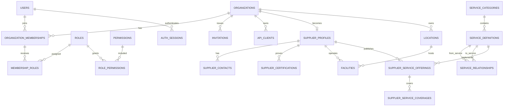
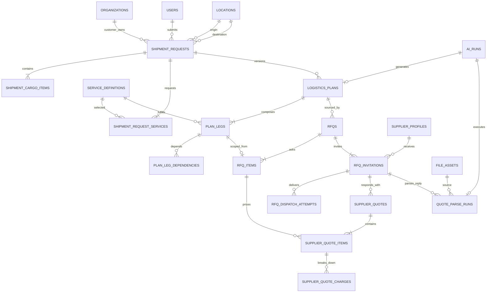
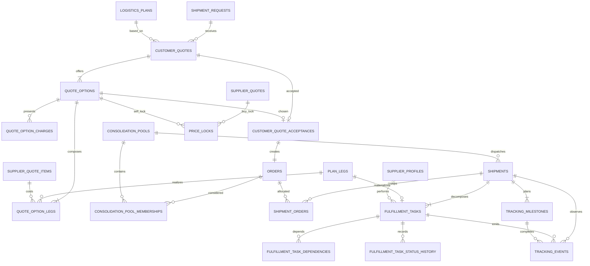
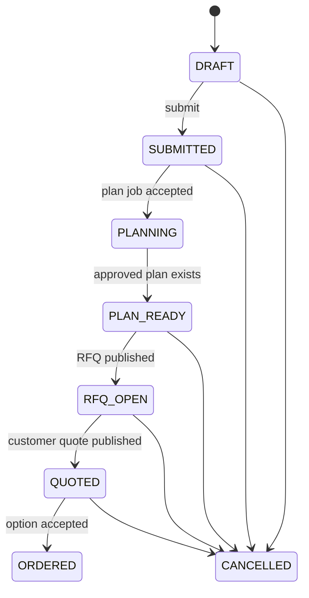
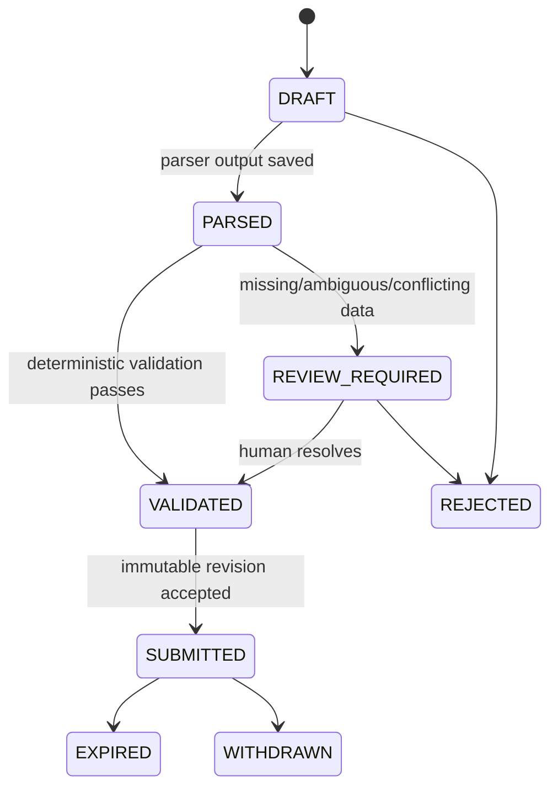
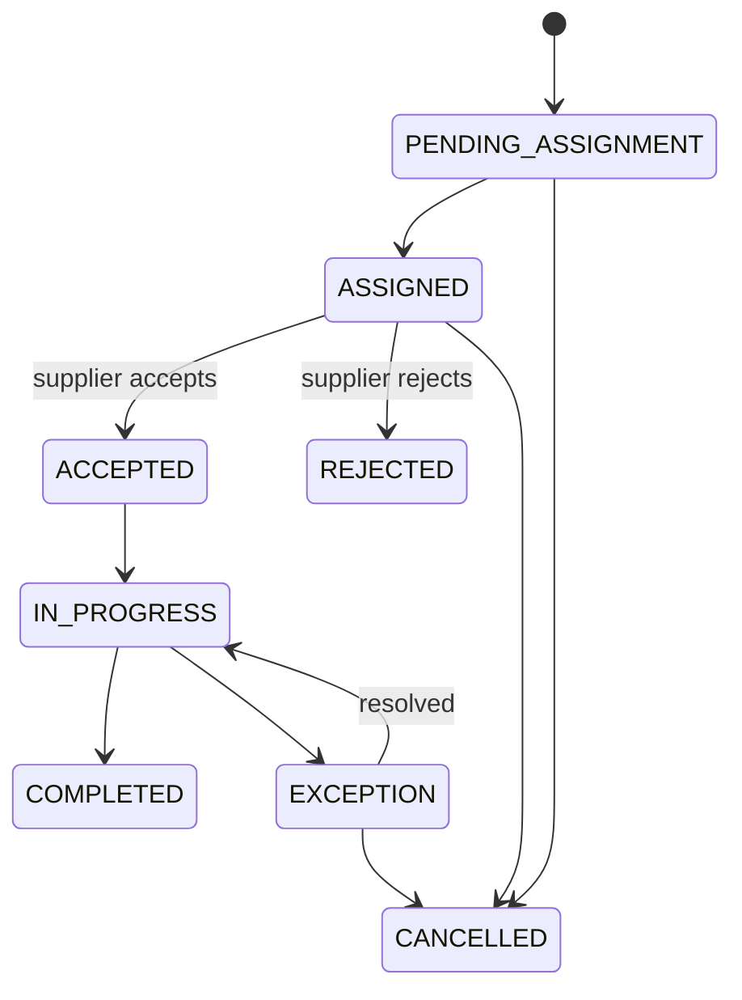

# 数据模型与 ER 图

## 1. 模型范围

基线 DDL 包含 **72 张业务/平台表、4 个可重建只读视图**，覆盖组织级 RBAC、服务市场、AI 方案、RFQ、供应商报价解析、客户报价、拼货、订单履约、Tracking、Supplier Center、Price Intelligence 和可靠集成。

完整字段、索引、外键和 CHECK 约束见 [marketplace_v1.sql](../../database/marketplace_v1.sql)。本文件解释实体关系和必须由数据库或领域层保持的业务不变量。

## 2. 数据建模约定

| 主题 | 约定 |
| --- | --- |
| 主键 | 所有业务实体使用 PostgreSQL `uuid`；默认 `gen_random_uuid()` |
| 时间 | 一律 `timestamptz`；展示时按组织/用户时区转换 |
| 金额 | `numeric(18,4)`；禁止 float/double；始终携带 ISO 4217 三位币种 |
| 价格分析 | 同时保留原币金额、CAD 归一化金额和当时 FX 快照 |
| 重量/体积 | 数据库存 kg / cbm；API 可接受其他单位但在边界标准化 |
| 加拿大邮编 | 保存规范化完整邮编和 FSA；FSA 格式为 `A1A` |
| 状态 | 使用 text + CHECK，而非 PostgreSQL enum，便于可控扩展和 Prisma migration |
| 乐观锁 | 可变 Aggregate 带 `version`；更新时要求 `WHERE id=? AND version=?` |
| 删除 | Master Data 可 `deleted_at`；交易、报价、事件和审计不得物理删除 |
| JSONB | 仅用于外部 payload、版本化快照、扩展条件和模型证据；可检索核心字段必须结构化 |
| 敏感信息 | 数据库只保存密码/Token hash 或经 KMS/Secrets Manager 加密的 ciphertext |
| 原始文件 | S3 Compatible 保存正文；`file_assets` 保存对象键、SHA-256、MIME、扫描状态和权限归属 |
| 模型输出 | `ai_runs` 保存模型/Prompt/Schema 版本与输入 hash；`ai_run_evidence` 保存证据引用 |
| 可靠消息 | 事务内写 `outbox_events`；消费者以 `inbox_messages` 去重 |

## 3. ER 图 A：身份、服务市场与供应商能力

### 关键含义

- 用户不直接持有一个全局 `role`。用户先加入组织，再通过 Membership 获得组织内角色。
- `PLATFORM` 组织承载管理员和销售；客户与供应商各是独立组织。
- 同一用户可以同时是平台销售、客户联系人或供应商人员，但权限按当前组织上下文计算。
- 服务不是硬编码枚举。`service_definitions` 定义可勾选或系统可规划服务，`service_relationships` 描述依赖、先后、排斥和替代。
- 供应商以 Offering 表达“能提供哪种服务”，以 Coverage 表达“在哪些起讫地、时间和条件下能提供”。

## 4. ER 图 B：需求、AI 方案、RFQ 与供应商报价

### 关键含义

- `Shipment Request` 是客户意图；`Logistics Plan` 是一个不可变 revision；`Plan Leg` 是可采购、可履约的最小服务节点。
- Plan 是 DAG。正常链路可以按 `sequence_number` 展示，真实依赖由 `plan_leg_dependencies` 保证。
- 一个 Plan 可以多轮 RFQ；每轮可邀请多个供应商，每个供应商可经不同渠道多次重试发送。
- 供应商每次修改报价都会产生新 `supplier_quotes.revision`，旧版本不覆盖。
- THC、DOC、Fuel、Tax、Accessorial 等统一进入 `supplier_quote_charges`，保留原文 `source_text` 供追溯。
- AI 解析失败或置信度不足时进入 `review_tasks`，不得直接进入客户报价组合。

## 5. ER 图 C：报价、订单、拼货、履约与 Tracking

### 关键含义

- Customer Quote 和 Quote Option 均是价格快照，不在供应商报价变化后自动回写。
- 接受记录强制所选 Option 属于该 Customer Quote；Order 强制引用同一接受记录中的 Option。
- Order 是商业承诺，Shipment 是运营编组。一个 Shipment 可拼多个 Order，一个 Order 也可在后续拆成多个 Shipment。
- 价格锁区分 BUY/SELL，并有明确的过期、消费、释放和作废状态。
- Fulfillment Task 是供应商权限隔离的最小单元；查询必须带 `supplier_organization_id = current_org_id`。
- Tracking Event 为追加式事实；统一 Timeline 是 Milestone 计划与真实 Event 的合并读模型。

## 6. ER 图 D：Price Intelligence、AI 治理与可靠集成

```mermaid
erDiagram
    SERVICE_DEFINITIONS ||--o{ PRICE_OBSERVATIONS : segments
    SUPPLIER_PROFILES ||--o{ PRICE_OBSERVATIONS : contributes_private
    PRICE_OBSERVATIONS ||--o{ PRICE_OBSERVATIONS : supersedes
    PRICE_FORECAST_MODELS ||--o{ PRICE_FORECASTS : produces
    AI_RUNS ||--o{ PRICE_FORECASTS : executes
    PRICE_FORECASTS ||--o{ PRICE_RECOMMENDATIONS : informs
    SHIPMENT_REQUESTS ||--o{ PRICE_RECOMMENDATIONS : contextualizes
    CUSTOMER_QUOTES ||--o{ PRICE_RECOMMENDATIONS : contextualizes
    QUOTE_OPTIONS ||--o{ PRICE_RECOMMENDATIONS : targets
    DYNAMIC_PRICING_POLICIES ||--o{ PRICING_DECISIONS : governs
    PRICE_RECOMMENDATIONS ||--o{ PRICING_DECISIONS : advises
    QUOTE_OPTIONS ||--o{ PRICING_DECISIONS : prices

    SUPPLIER_PROFILES ||--o{ SUPPLIER_KPI_SNAPSHOTS : measures
    SUPPLIER_PROFILES ||--o{ SUPPLIER_COMPLAINTS : receives
    ORGANIZATIONS ||--o{ FILE_ASSETS : owns
    FILE_ASSETS ||--o{ FILE_ASSET_LINKS : attaches
    ORGANIZATIONS ||--o{ INTEGRATION_CONNECTIONS : configures
    AI_RUNS ||--|{ AI_RUN_EVIDENCE : cites
    AI_RUNS ||--o{ REVIEW_TASKS : may_create

    ORGANIZATIONS ||--o{ OUTBOX_EVENTS : scopes
    OUTBOX_EVENTS ||--o{ WEBHOOK_DELIVERIES : delivers
    WEBHOOK_SUBSCRIPTIONS ||--o{ WEBHOOK_DELIVERIES : receives
    ORGANIZATIONS ||--o{ NOTIFICATIONS : receives
    ORGANIZATIONS ||--o{ ASYNC_OPERATIONS : requests
    ORGANIZATIONS ||--o{ AUDIT_LOGS : scopes
```

### Price Intelligence 四个子模块

| 子模块 | 输入 | 持久化 | 输出/护栏 |
| --- | --- | --- | --- |
| Price Collector | 供应商报价、价卡、历史、成交 | `price_observations` | 记录原币、CAD、FX、来源、权限、质量分和 lineage；追加式修正 |
| Price Forecast | 合格 observation 的分段时间序列 | `price_forecast_models`, `price_forecasts` | 仅允许 7/14/30 天；保存 P10/P50/P90、样本数、训练截止和模型版本 |
| Price Recommendation | 成本、Forecast、容量、热度、毛利策略 | `price_recommendations` | 给销售/采购建议区间；低置信度或过期结果不得应用 |
| Dynamic Pricing | 推荐、拼货容量、舱位、市场热度和显式策略 | `dynamic_pricing_policies`, `pricing_decisions` | 最低毛利、最大折扣/加价、人工阈值、Shadow 模式和完整输入快照 |

### 价格隐私

1. 单个供应商报价默认 `visibility=PRIVATE`，不得暴露给其他供应商。
2. 外部展示只能使用达到最小样本量并去标识化的 `AGGREGATED` 数据。
3. Forecast 的 `training_cutoff_at` 防止未来数据泄漏；回测必须按时间切分。
4. 推荐只使用明确列入 `evidence_snapshot` 的数据；任何无法追溯的金额不得进入定价。
5. AI 可以建议区间，但实际发布价格必须通过确定性 Guardrail；越过阈值必须人工审批。

## 7. 初始服务目录

以下是数据库阶段的初始 Reference Data，不是代码枚举。管理员可新增、停用或调整关系。

| 分类 | 初始 code | 展示名 |
| --- | --- | --- |
| Transportation | `LCL`, `FCL`, `AIR`, `EXPRESS` | LCL / FCL / Air / Express |
| Origin | `PICKUP`, `ORIGIN_WAREHOUSE`, `EXPORT_CUSTOMS` | Pickup / Warehouse / Export Customs |
| Canada Import | `BOND`, `IMPORT_CUSTOMS`, `SELF_IMPORT`, `DDP`, `GST`, `CARM` | Bond / Customs / Self Import / DDP / GST / CARM |
| Warehousing | `VANCOUVER_WAREHOUSE`, `TORONTO_WAREHOUSE`, `BONDED_WAREHOUSE`, `FBA` | 对应四类仓储服务 |
| Final Mile | `LTL`, `FTL`, `UPS`, `FEDEX` | LTL / FTL / UPS / FedEx |
| Value Added | `INSURANCE`, `PALLET`, `LABEL`, `INSPECTION` | Insurance / Pallet / Label / Inspection |
| System-plannable | `CFS`, `RAIL`, `CROSS_DOCK`, `LAST_MILE_SORT` | AI/规则可加入、但不一定直接展示为客户勾选项 |

## 8. 核心状态机

### Shipment Request

### Supplier Quote 解析与放行

### Fulfillment Task

## 9. 数据库强约束与领域层约束

### 数据库直接保证

- Plan 与 RFQ/Customer Quote 属于同一 Shipment Request。
- Supplier Quote 的 supplier 与 RFQ Invitation 的 supplier 一致。
- Accepted Quote Option 属于被接受的 Customer Quote；Order 引用同一 Option。
- 金额、重量、体积、置信度、时间窗和 ISO code 的基本合法性。
- 同一 RFQ 对同一供应商只有一条 Invitation；revision、line number 唯一。
- 一个 Customer Quote 最多一个 `is_recommended=true` 的 Option。
- Tracking、价格事实、任务状态历史、供应商 KPI 和审计记录禁止 UPDATE/DELETE。
- Outbox、Webhook、通知和 HTTP command 具备幂等键/去重键。

### 领域层 + 集成测试保证

- Plan DAG 无环，依赖节点属于同一个 Plan。
- 所有客户勾选的 REQUIRED 服务在已批准 Plan 中被覆盖。
- 供应商 Offering/Coverage 满足 RFQ Item 的地点、能力、货量和日期要求。
- Supplier Quote 合计等于 Item/Charge 标准化合计；币种转换引用锁定 FX 快照。
- Quote Option 的成本腿完整覆盖 Plan，不重复采购同一必需 Leg。
- 拼货确认后不超过 Pool 最大 kg/cbm；并发预留采用行锁 + version CAS。
- 任务状态只能按允许的转换表前进；完成前所有前置依赖已完成。
- 模型输出 Schema、证据引用、置信度、价格护栏与人工审批满足发布规则。

## 10. 数据保留建议

| 数据 | 建议 |
| --- | --- |
| Auth session / idempotency | 到期后保留 30-90 天再清理 |
| 原始 RFQ/报价文件 | 默认 7 年或按合同/隐私政策配置 |
| Customer/Supplier Quote、Order、履约 | 至少 7 年；只追加修订，不覆盖 |
| Tracking raw payload | 热数据 12-24 个月，之后压缩/归档至 S3 |
| Price Observation/Forecast | 事实长期保留；模型中间产物按版本和审计要求保留 |
| Audit Log | 至少 7 年；WORM/归档策略由合规阶段确认 |
