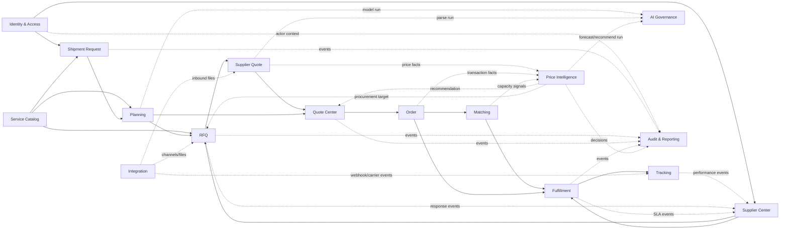
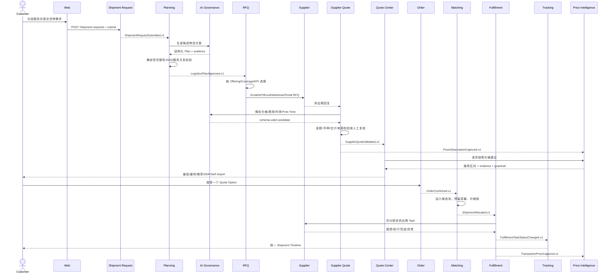

# 模块关系与 DDD Context Map

## 1. 限界上下文总图

实线表示同步业务依赖；虚线表示异步事件、分析信号或技术支撑。图中的方向是“使用对方公开能力”，不是数据库表级依赖许可。

## 2. 上下文关系类型

| 上游 | 下游 | 类型 | 合约 |
| --- | --- | --- | --- |
| Identity & Access | 全部业务模块 | Open Host Service | `ActorContext`, Permission Guard, organization scope |
| Service Catalog | Planning/RFQ/Fulfillment | Published Language | `ServiceDefinitionRef`, Offering/Coverage query |
| Shipment Request | Planning | Customer/Supplier | `ShipmentRequestSubmitted.v1` + request query facade |
| Planning | RFQ | Customer/Supplier | `LogisticsPlanApproved.v1` + immutable plan snapshot |
| Supplier Center | RFQ | Conformist Query | supplier capability/KPI candidate query；RFQ 保留 selection snapshot |
| RFQ | Supplier Quote | Customer/Supplier | Invitation、RFQ Item snapshot、reply correlation token |
| Supplier Quote | Quote Center | Published Language | `SupplierQuoteValidated.v1` + normalized charges |
| Quote Center | Order | Customer/Supplier | `CustomerQuoteAccepted.v1`；接受快照不可变 |
| Order/Matching | Fulfillment | Customer/Supplier | `ShipmentAllocated.v1`；按 plan leg 拆 task |
| Fulfillment | Tracking | Domain Events | task 状态映射为里程碑/Timeline Event |
| RFQ/Quote/Order/Fulfillment | Price Intelligence | Event-fed Analytics | 只消费合法、带 lineage 的价格与容量事实 |
| Price Intelligence | Quote Center/RFQ | Advisory Service | 推荐/采购目标；不得直接改写报价或 RFQ |
| AI Governance | Planning/Supplier Quote/Price Intelligence | Supporting Context | 模型运行、证据、Schema validation、review task |
| Integration | RFQ/Supplier Quote/Tracking | Anti-Corruption Layer | 把 Email/API/Excel/Webhook/Carrier payload 归一化为内部命令 |

## 3. 主交易流程

## 4. 领域事件目录

事件命名使用过去式；payload 不发送秘密、整张价卡或不必要的 PII。事件 schema 放入 `packages/contracts/events/<event>/v1.ts` 并同步 JSON Schema。

| Event | Producer | Consumers | 必要 payload |
| --- | --- | --- | --- |
| `ShipmentRequestSubmitted.v1` | Shipment Request | Planning, Audit, Notification | request id、org id、version、requested service ids |
| `LogisticsPlanGenerated.v1` | Planning | AI Governance, Audit | plan id/revision、generation mode、validation summary |
| `LogisticsPlanReviewRequired.v1` | Planning | Review/Notification | plan id、reason codes、severity |
| `LogisticsPlanApproved.v1` | Planning | RFQ, Shipment Request | plan id/revision、request id |
| `RfqPublished.v1` | RFQ | Integration, Supplier Center | RFQ id/round、invitation ids、due time |
| `RfqDispatchRequested.v1` | RFQ | Integration Worker | invitation id、channel、idempotency key |
| `RfqReplyReceived.v1` | Integration | Supplier Quote | invitation id、source file id、message hash |
| `SupplierQuoteReviewRequired.v1` | Supplier Quote | Review/Notification | parse run、reason codes、source file id |
| `SupplierQuoteValidated.v1` | Supplier Quote | Quote Center, Price Intelligence, Supplier Center | quote revision、normalized totals、service items |
| `CustomerQuotePublished.v1` | Quote Center | Notification, Audit | quote revision、option ids、valid until |
| `CustomerQuoteAccepted.v1` | Quote Center | Order, Price Intelligence | acceptance id、option snapshot id、customer org |
| `OrderConfirmed.v1` | Order | Matching, Notification | order id、destination/time/weight/volume summary |
| `PoolCapacityChanged.v1` | Matching | Price Intelligence, Dashboard | pool id、committed/remaining kg/cbm |
| `ConsolidationConfirmed.v1` | Matching | Order, Fulfillment | pool id、order ids、shipment allocation |
| `ShipmentAllocated.v1` | Order/Matching | Fulfillment, Tracking | shipment id、plan id、order allocation |
| `FulfillmentTaskAssigned.v1` | Fulfillment | Supplier Portal, Notification | task id、supplier org、schedule |
| `FulfillmentTaskStatusChanged.v1` | Fulfillment | Tracking, Supplier Center, Notification | task id、from/to、occurred time、exception code |
| `TrackingEventRecorded.v1` | Tracking | Notification, Dashboard | shipment id、event code、occurred time、location ref |
| `TransactionPriceCaptured.v1` | Order/Fulfillment | Price Intelligence | source ids、normalized charge facts、currency/FX |
| `SupplierKpiSnapshotCalculated.v1` | Supplier Center | RFQ, Dashboard | supplier id、window、metric version、KPI values |
| `PriceForecastGenerated.v1` | Price Intelligence | Quote Center, Dashboard | segment、horizon、P10/P50/P90、model id |
| `PriceRecommendationCreated.v1` | Price Intelligence | Quote Center/RFQ | context id、range、confidence、evidence ref |
| `PricingApprovalRequired.v1` | Price Intelligence | Review/Notification | decision id、guardrail reasons、approver permission |

## 5. 同步 API Facade

模块内部可以拥有多个 use case，但对其他模块只公开小型 facade：

| Facade | 允许的同步调用 | 禁止 |
| --- | --- | --- |
| `IdentityAccessFacade` | resolve actor、check permission、resolve current org | 返回密码/token/hash |
| `CatalogQueryFacade` | service definition、relationship graph、offering coverage query | 由调用方直接查 Catalog Repository |
| `ShipmentRequestQueryFacade` | 获取批准用途的 immutable request snapshot | 修改 request |
| `PlanningQueryFacade` | 获取 approved plan revision | 获取未验证 AI raw output |
| `SupplierEligibilityFacade` | 根据 service/coverage/risk/KPI 返回候选与理由 | 暴露其他供应商私密报价 |
| `SupplierQuoteQueryFacade` | 获取 VALIDATED/SUBMITTED revision snapshot | 返回未复核 parse candidate |
| `PriceAdvisoryFacade` | forecast/recommendation/simulation | 直接更新 Quote Option |
| `TrackingCommandFacade` | 记录经签名/授权的标准化 Event | 让外部 payload 直接改 Shipment 状态 |

## 6. 模块禁止依赖矩阵

| 规则 | 自动化检查 |
| --- | --- |
| Domain 不 import Nest/Prisma/HTTP | ESLint boundaries + dependency-cruiser |
| 模块 A 不 import 模块 B 的 Infrastructure/Repository | path aliases + architecture test |
| Controller 不直接使用 Prisma Client | static import rule |
| Worker 不复制领域规则 | Worker 只能调用 application commands/facades |
| Reporting 不回写领域表 | DB user read-only + code ownership test |
| Price Intelligence 不直接发布/修改报价 | 无 Quote Repository 依赖；只发 recommendation/approval event |
| Integration 不决定业务状态 | Anti-Corruption Layer 只生成标准化 command |

## 7. 失败与补偿

MVP 不使用分布式事务或 Saga 框架；使用本地事务 + Outbox + 显式补偿：

| 场景 | 处理 |
| --- | --- |
| RFQ 入库成功但邮件失败 | Invitation 保持 `SENT/FAILED` 可见；按退避重试，不回滚 RFQ |
| 回复文件入库但 AI 解析失败 | 原文件保留；Parse Run 失败；创建 Review Task |
| Customer Quote 发布后供应商报价撤回 | 不改旧 Quote；生成风险事件和新 revision/人工处理 |
| Quote 已接受但价格锁失败 | Order 保持受控 `CONFIRMED`，创建高优先级 Review；不得静默改价 |
| 拼货并发超容量 | `version` CAS + 行锁使一个请求失败；失败方重新匹配 |
| Task 完成事件重复 | Inbox/外部事件去重键返回已处理结果 |
| Tracking Webhook 乱序 | 事件按 `occurred_at` 展示；里程碑状态用版本化归并策略，不删除旧事件 |
| Forecast 模型异常 | 旧有效模型继续服务；新模型保持 Candidate/Shadow；不影响确定性报价 |

## 8. 将来拆分微服务的触发条件

只有满足下列一项并有压测/组织证据时才拆：

- 一个上下文需要独立扩缩容且已显著影响其他模块 SLO。
- 团队已形成长期独立 ownership，发布节奏互相阻塞。
- 数据隔离或合规要求必须独立部署/独立数据库。
- Worker 负载（例如 AI parse 或 forecast）需要完全不同的资源模型。

拆分顺序建议：Integration/Worker → Price Intelligence → Tracking；Identity、Catalog、核心交易在 MVP 期保持模块化单体。
