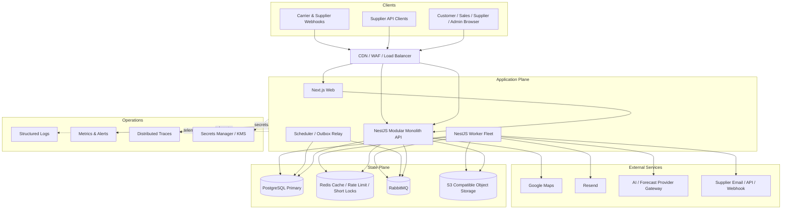
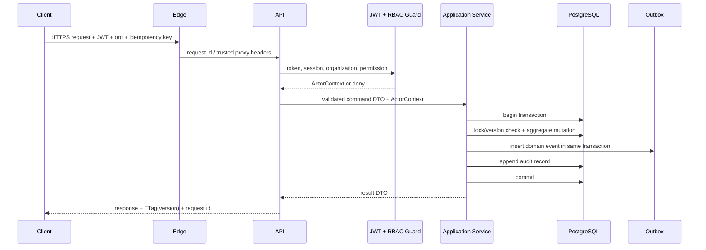
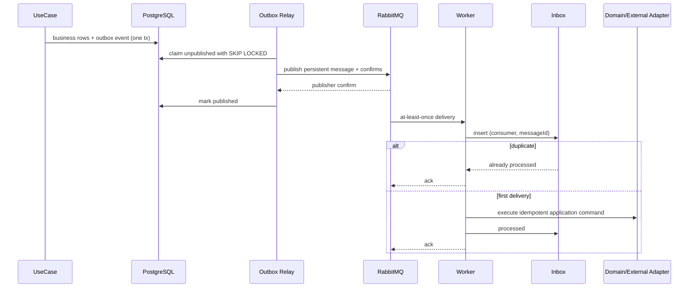
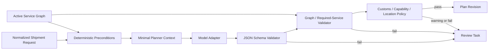
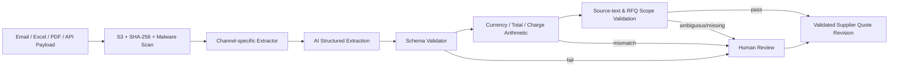

# 技术架构

## 1. 运行时总图



## 2. 部署单元

| 单元 | 进程模型 | 主要职责 | 扩缩容依据 |
| --- | --- | --- | --- |
| `web` | Next.js Node process | SSR/BFF-less UI、静态资源、角色门户 | HTTP RPS、CPU、render latency |
| `api` | NestJS HTTP process | REST、认证授权、同步用例、事务、Outbox 写入 | HTTP RPS、P95、DB pool wait |
| `worker` | NestJS standalone | 计划生成、报价解析、渠道分发、通知、Tracking、价格任务 | Queue depth、oldest age、job latency |
| `outbox-relay` | Worker role | `FOR UPDATE SKIP LOCKED` 领取并发布事件 | pending outbox age |
| `scheduler` | Worker role | RFQ 到期、价格锁过期、Forecast、KPI、清理 Job | schedule drift、job success |
| PostgreSQL | 主库；需要时读副本 | 唯一业务事实源、事务和读模型 | connections、IOPS、locks、replication lag |
| RabbitMQ | durable quorum queues | 至少一次异步投递、重试、DLQ | queue depth、unacked、redelivery |
| Redis | 可丢失数据 | Cache、限流、短时去重/锁 | memory、evictions、hit rate |
| S3 Compatible | versioned bucket | 原始邮件/Excel/PDF/POD、模型大对象 | storage、error rate、scan backlog |

MVP 可以用 Docker Compose 或一个受控容器环境部署这三个应用单元；数据库、对象存储和消息队列优先采用有备份和监控的托管/高可用方案。模块化单体保持未来独立部署边界，但第一阶段不拆 12 个微服务。

## 3. 同步请求链路



同步链路不等待 Email、Webhook、AI、Forecast 或 Supplier API。需要长任务时返回 `202 Accepted` 和 `operationId`。

## 4. 可靠异步链路



### 4.1 RabbitMQ topology

| Exchange | Routing key 示例 | Queue | DLQ |
| --- | --- | --- | --- |
| `domain.events` (topic) | `shipment.request.submitted.v1` | `planning.generate` | `planning.generate.dlq` |
| `domain.events` | `plan.approved.v1` | `rfq.prepare` | `rfq.prepare.dlq` |
| `integration.commands` | `rfq.dispatch.email.v1` | `rfq.dispatch.email` | `rfq.dispatch.email.dlq` |
| `integration.commands` | `rfq.dispatch.api.v1` | `rfq.dispatch.api` | `rfq.dispatch.api.dlq` |
| `integration.commands` | `quote.parse.v1` | `quote.parse` | `quote.parse.dlq` |
| `domain.events` | `supplier.quote.validated.v1` | `price.collect` | `price.collect.dlq` |
| `domain.events` | `fulfillment.task.changed.v1` | `tracking.project` | `tracking.project.dlq` |
| `scheduled.commands` | `price.forecast.run.v1` | `price.forecast` | `price.forecast.dlq` |
| `integration.commands` | `notification.send.v1` | `notification.send` | `notification.send.dlq` |
| `integration.commands` | `webhook.deliver.v1` | `webhook.deliver` | `webhook.deliver.dlq` |

每个 Queue 独立配置并发、timeout、最大重试和退避。业务错误进入 Review Task，不反复重试；网络/限流错误退避重试；毒消息进入 DLQ 并告警。

## 5. AI 与 Price Intelligence 架构

### 5.1 AI Logistics Planner



模型只返回结构化候选 Plan。服务存在性、必需服务覆盖、关系、DAG 无环、地点连续性、供应商能力可采购性由确定性代码校验；未通过不得批准。

### 5.2 Supplier Quote Parser



- Excel 使用 SheetJS 读取受限 worksheet/范围；原 workbook 不直接交给模型。
- Email/文档先提取文本和小型证据片段；模型输出每个费用字段的来源片段或 evidence key。
- `total != items/charges`、币种缺失、有效期歧义、负数费用、RFQ line 无匹配都会阻断。

### 5.3 Price Intelligence Pipeline

```mermaid
flowchart LR
    Events[Quotes / Transactions / Rate Cards]
    Collector[Price Collector]
    Quality[Normalization + FX + Quality + Privacy]
    Obs[(Price Observations)]
    Features[Time-safe Feature Builder]
    Train[Forecast Train / Backtest]
    Registry[Candidate / Shadow / Active Registry]
    Forecast[7 / 14 / 30 Day Quantile Forecast]
    Recommend[Sales & Procurement Recommendation]
    Policy[Dynamic Pricing Policy Engine]
    Guard[Floor / Margin / Discount / Approval Guard]
    Decision[Audited Pricing Decision]

    Events --> Collector --> Quality --> Obs
    Obs --> Features --> Train --> Registry --> Forecast
    Forecast --> Recommend
    Obs --> Recommend
    Recommend --> Policy --> Guard --> Decision
```



关键边界：

1. Forecast 可以使用时间序列/统计/机器学习模型，不强制使用 LLM。
2. 训练、回测、推理都保存模型版本、训练截止、数据 hash、样本数和误差指标。
3. 新模型先 Candidate，再 Shadow；达到误差、覆盖率和业务门槛后人工激活。
4. 推荐不是报价事实。Quote Center 只能应用有效、未过期、通过 Guardrail 的建议。
5. Dynamic Pricing 的最终数值由版本化策略和确定性 clamp 计算；高风险变化必须审批并生成新 Quote revision。
6. 现有确定性 Zone Quote Engine 的价格锁定原则继续有效：无法证明来源时返回 Review，不生成可发布金额。

## 6. 技术选型映射

| PRD 技术 | 架构使用方式 |
| --- | --- |
| Next.js + React + TypeScript | 四角色门户、SSR/CSR 混合、由 OpenAPI 生成 typed client |
| TailwindCSS | Design tokens + shared UI package；不在页面散落业务状态 |
| NestJS | REST API、模块化单体、Guard/Interceptor、standalone Worker |
| PostgreSQL | 事务事实源、JSONB 扩展字段、Outbox/Inbox、只读投影 |
| Prisma | Schema/migration/client；Repository adapter 隔离，Domain 不依赖 Prisma type |
| Redis | Rate limit、短缓存、短锁；缓存失效不影响事实正确性 |
| RabbitMQ | 异步命令、领域事件分发、重试、DLQ |
| S3 Compatible | 原始回复、Excel/PDF、POD、模型 artifact；预签名 URL + hash |
| Google Maps | 地址验证、地理编码、距离/地图显示 Adapter；结果缓存和人工 override |
| Resend | 平台出站邮件 Adapter；delivery/bounce Webhook 回写 Dispatch 状态 |
| SheetJS | RFQ Excel 模板生成、供应商回复受限解析和字段验证 |
| JWT + RBAC | 用户/API Client 短时 JWT；组织级 Membership/Role/Permission |
| REST | MVP 唯一业务 API；OpenAPI 合约优先 |
| GraphQL 预留 | Application query facade/DTO 可复用；不在 MVP 实现 |

## 7. 缓存策略

| 缓存 | Key 示例 | TTL/失效 | 回源 |
| --- | --- | --- | --- |
| Service Catalog | `catalog:active:v<revision>` | 5-15 min；Catalog event 主动失效 | PostgreSQL |
| Permission set | `authz:<membership>:v<roleVersion>` | 5 min；角色变更失效 | PostgreSQL |
| Supplier eligibility | `eligibility:<criteriaHash>` | 1-5 min；Offering/KPI 变更失效 | Query facade |
| Map/geocode | `geocode:<normalizedHash>` | 长 TTL；地址 override 失效 | Google Maps |
| Dashboard | `dashboard:<org>:<queryHash>` | 15-60 s | read model/view |

报价、价格锁、池容量、Order/Task 状态不以缓存作为决策依据；最终写入时必须回数据库重新校验。

## 8. 安全架构

### 8.1 身份与授权

- 密码使用强哈希；Refresh Token 和 API secret 只存 hash，支持轮换和撤销。
- 每个请求构造不可变 `ActorContext(user/client, organization, permissions, requestId)`。
- 资源级授权不只检查 permission，还检查 customer/supplier ownership 和 assignment。
- Supplier Portal 的所有 RFQ/Quote/Task 查询在 Repository 层强制当前 `supplier_organization_id`。
- 对“通过改 ID 访问其他组织数据”的 BOLA/IDOR 场景建立自动化测试矩阵。

### 8.2 数据与秘密

- 全链路 TLS；数据库、RabbitMQ、Redis、S3 使用私网和加密连接。
- 集成 Credential 使用 Secrets Manager/KMS；数据库保存 ciphertext 和 key reference，不保存明文。
- S3 bucket 默认私有、启用版本控制；下载使用短时预签名 URL。
- 上传文件先隔离，SHA-256 校验和病毒扫描通过后才可解析。
- Logs/Traces 对 Token、Cookie、Email 正文、价格表和个人信息做字段级脱敏。

### 8.3 AI 数据边界

- 模型输入按任务做最小化；不得发送完整价卡、跨供应商私密报价、密钥或无关客户信息。
- Provider、Model、Prompt、Schema 和 Evidence 全部版本化。
- 模型返回值只作为候选；Schema validation、来源校验和业务 Guardrail 在模型之外执行。
- 模型不可调用任意 SQL/S3；只通过白名单 Tool/Port 获取最小证据。
- 供应商价格数据用于模型训练前必须经过授权、去标识化和最小样本门槛检查。

## 9. 可观测性与 SLO

### 9.1 Telemetry

- JSON structured log：`timestamp`, `level`, `service`, `module`, `requestId`, `correlationId`, `actorType`, `organizationId`, `entityRef`, `errorCode`。
- OpenTelemetry Trace 覆盖 Web → API → DB/Redis/RabbitMQ → Worker → external adapter。
- Metrics：HTTP、DB pool、Outbox age、Queue depth/age、job latency、DLQ、RFQ delivery、AI validation、Review SLA、Forecast error、pricing approval、Webhook delivery。

### 9.2 初始目标

| 能力 | SLO/门槛 |
| --- | --- |
| 核心读 API | 月可用性 99.9%；P95 `< 500 ms`（不含文件/AI） |
| 核心写 API | P95 `< 800 ms`；事务不等待外部服务 |
| AuthZ | P95 `< 50 ms`（命中权限缓存）；Cache miss 可回 DB |
| Outbox 发布 | P95 事件年龄 `< 5 s` |
| RFQ Email/API 分发 | P95 开始发送 `< 60 s` |
| AI Quote Parse | P95 `< 3 min`；超时进入可重试/人工 |
| Tracking Event 可见 | P95 `< 30 s` |
| 重复命令副作用 | `0` |
| 未授权跨组织数据访问 | `0` |
| 无来源金额被发布 | `0` |
| DLQ 未告警时间 | `< 5 min` |

### 9.3 运维仪表盘

- API：RPS、P50/P95/P99、4xx/5xx、DB pool wait、slow query。
- Workflow：Submitted → Plan → RFQ → Supplier Quote → Customer Quote → Accepted 转化与耗时。
- Queue：depth、oldest age、redelivery、retry、DLQ。
- Supplier：response/fulfillment/complaint/KPI freshness。
- Price Intelligence：observation quality、segment coverage、forecast MAE/MAPE/coverage、recommendation adoption、margin guardrail hits、drift。

## 10. 备份、恢复与连续性

| 对象 | 策略 |
| --- | --- |
| PostgreSQL | 自动备份 + Point-in-Time Recovery；每日恢复演练的自动校验 |
| S3 | Versioning + lifecycle + 跨故障域复制（按环境能力） |
| RabbitMQ | Durable/quorum queues；消息可由 Outbox 重新发布 |
| Redis | 可从事实源重建；不设为恢复关键路径 |
| 配置/Secret | IaC + Secrets Manager 版本；不进 Git |

MVP 建议目标：核心数据库 RPO ≤ 15 分钟、RTO ≤ 4 小时；上线前通过真实恢复演练确认，不以“已配置备份”替代恢复证明。

## 11. 环境与发布

```text
local -> test/CI -> staging -> production
```

- 环境数据和 Credential 完全隔离。
- Migration 使用 expand → deploy → backfill → contract，禁止一次发布做不可回滚破坏性变更。
- API、Worker 和 Web 用同一 Git SHA/contract version 构建；Worker 消费者向后兼容至少一个事件版本。
- Feature Flag 用于 AI Planner、自动选商、Dynamic Pricing、模型版本和新供应商渠道；Flag 不是授权机制。
- 每次发布运行：unit → integration(PostgreSQL/RabbitMQ) → contract → migration from empty + previous → e2e → smoke。
