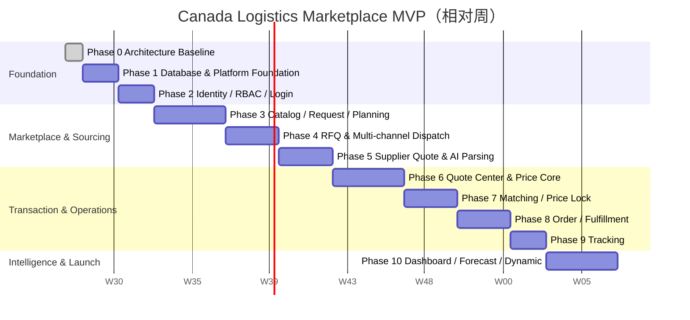
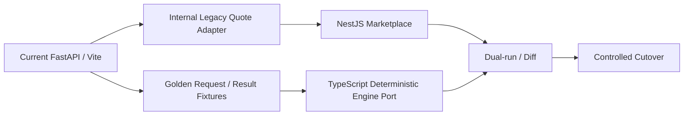

# MVP 开发计划

## 1. 计划假设

### 团队基线

- 1 Product Owner/物流领域负责人。
- 1 Tech Lead/架构负责人。
- 2 Backend、2 Frontend、1 Data/ML。
- 1 QA Automation；DevOps/Security 由平台工程兼职或共享。
- 供应商 Email/API/Excel/Webhook 中至少有 2 家真实试点伙伴可参与联调。

完整 PRD 包含 12 个业务模块、四类外部渠道、AI 解析、预测和动态定价，不应按“小型 CRUD MVP”估算。在以上团队假设下：

- **Pilot 核心闭环（Phase 1-6）**：约 14-16 周。
- **完整本 PRD MVP（Phase 1-10）**：约 22-26 周。
- 若只有 1-2 名全栈开发，应先缩小渠道、履约和 Price Intelligence 范围，不能靠降低测试/审计门槛压缩周期。

## 2. 交付路线

实际执行可在后半程并行：前端在 API contract freeze 后开发；Data/ML 从 Phase 4 开始构建 observation pipeline；Tracking 可在 Fulfillment Task contract 稳定后并行。

## 3. Phase 0：架构设计（本轮）

### 交付

- 目标目录和 DDD 模块模板。
- 72 表 ER 模型、PostgreSQL baseline DDL 和关键状态机。
- Context Map、领域事件和事务边界。
- REST API surface、权限、幂等、错误和 Webhook 合约。
- 技术架构、队列拓扑、AI/价格护栏、SLO。
- 开发计划、风险、迁移策略和 ADR。

### Exit Gate

- Product/Tech/Data/Security 四方确认架构评审门。
- 未决业务问题有 Owner 和截止日期；不会在数据库实施时临时猜测。
- 明确本轮无业务代码和现有系统破坏性改动。

## 4. Phase 1：数据库设计与平台基础

### 范围

1. 建立 pnpm/Turborepo 的目标数据库 package；不移动 legacy 代码。
2. 将 `marketplace_v1.sql` 翻译为 Prisma schema。
3. 生成 `0001_marketplace_baseline` migration；空库和 previous-version 两条路径可执行。
4. 创建基础 Reference Data：平台组织、系统角色/权限、初始服务分类/服务/关系。
5. 创建数据库连接、事务、Repository contract、Outbox/Inbox 基础设施测试。
6. 建立 PostgreSQL 集成测试容器和 schema drift 检查。
7. 定义脱敏样例与 legacy Zone/价卡数据映射，但不导入生产数据。

### Exit Gate

- 空 PostgreSQL 从零迁移成功；重复执行/回滚演练结果明确。
- 72 表、外键、CHECK、唯一/部分索引、trigger、4 个 view 与 DDL 基线一致。
- 关键约束负向测试通过：跨 Quote Option 接受、跨 Supplier Invitation 报价、超容量/非法金额等。
- Prisma migration 不依赖 `db push`；CI 检测 drift。
- Seed 可重复，系统权限 code 稳定且无明文 secret。
- 备份与恢复最小演练通过。

## 5. Phase 2：用户、权限、登录

### 范围

- User、Organization、Membership、Role、Permission、Invitation。
- Access JWT、Refresh rotation、logout/revoke、API Client。
- `ActorContext`、组织切换、RBAC Guard、资源 ownership policy。
- 四角色门户的登录/基础布局。
- Audit Log 和权限管理后台。

### Exit Gate

- 客户、销售、供应商、管理员四类账号完成端到端登录。
- 供应商通过猜测 ID 无法访问其他供应商资源；客户同样隔离。
- Refresh reuse、disabled user、revoked client、expired invitation 测试通过。
- 100% 高风险写端点有 permission + ownership policy 测试。

## 6. Phase 3：服务市场、Shipment Request 与 Planning

### 范围

- 动态 Service Category/Definition/Relationship 管理。
- Supplier Offering/Coverage/Facility 的基础管理。
- 客户勾选服务、地址、cargo、时间窗提交。
- Google Maps 地址验证 Adapter 和人工 override。
- Hybrid Logistics Planner：规则预处理 → AI candidate → Schema/DAG/服务关系/地点连续性校验 → Review/Approve。
- Plan revision 和完整证据链。

### Exit Gate

- 管理员不改代码即可新增/停用服务。
- PRD 示例可生成 `Pickup → Export Customs → LCL → Vancouver CFS → Bond → Rail → Toronto Warehouse → LTL`。
- 缺 REQUIRED 服务、排斥服务、DAG 环、地点断链、无可采购能力均不能批准。
- AI Provider 超时/停机时请求保留，可人工规划，不产生伪造方案。

## 7. Phase 4：RFQ 自动询价中心

### 范围

- Approved Plan 创建 RFQ Item。
- Offering/Coverage/KPI/风险过滤和可解释选商。
- Email/Portal 先上线；API/Webhook/Excel Adapter 在相同 Contract 下增量启用。
- Resend、Excel Template/SheetJS、Supplier API/Webhook、Dispatch Attempt、重试/DLQ。
- RFQ due/close、decline、resend、渠道投递审计。

### Exit Gate

- 同一 RFQ 批量发给多个供应商；重复 publish/resend 不产生重复外部副作用。
- 渠道失败不回滚 RFQ，可见、可重试、可进 DLQ。
- 供应商收到的 RFQ 只包含其所需范围和最小必要客户信息。
- 至少 Email + Portal 与 1 个 API/Webhook 或 Excel 真实试点通过。

## 8. Phase 5：Supplier Center、AI 报价解析

### 范围

- Supplier Profile、Contact、Certification、Offering/Coverage 完整工作流。
- Portal/API 结构化报价；Email/Excel/PDF 原始回复接入。
- 文件 S3、hash、病毒扫描、受限文本/worksheet 提取。
- AI 解析 price/currency/THC/DOC/transit/free time/notes。
- Schema、算术、RFQ scope、币种、有效期和 evidence 校验。
- 人工 Review、纠正、validated Supplier Quote revision。

### Exit Gate

- 试点真实报价集字段级准确率门槛由业务定义并达到；金额/币种错误必须 `0` 次自动放行。
- `total != items/charges`、币种缺失、有效期冲突、未匹配 RFQ line 会阻断。
- 原始回复、模型 run、Prompt/Schema、人工修改和最终 revision 可完整追溯。
- 同一 Supplier Quote revision 不可覆盖，撤回/过期保留历史。

## 9. Phase 6：Quote Center 与 Price Intelligence Core

### 范围

- Supplier Quote legs 组合和成本快照。
- 最低价、最快、推荐、DDP、Self Import 方案。
- 客户/销售比较、内部成本权限、发布/修订/有效期/接受。
- Price Collector 接入供应商报价、价卡、历史和成交价。
- Forecast 数据质量/分段/回测框架；先以 baseline/Shadow 运行。
- Sales/Procurement Recommendation 和确定性 Guardrail。

### Exit Gate

- 每个 Quote Option 完整覆盖 Plan，成本与 Sell/Margin 算术一致。
- Customer 绝不看到 Internal-only charge 或其他 Supplier 身份/价格。
- 接受只能选择本 Quote 的有效 Option；重复接受只创建一个 Order。
- 所有金额可回溯到 Supplier Quote/Price Observation/FX/策略证据。
- 无来源或低置信度推荐不能发布；越过 Guardrail 必须 Review/Approval。

### Pilot Gate

Phase 1-6 完成后可做受控 Pilot：客户提交 → AI Plan → RFQ → 供应商回复 → AI Parse → 多方案 Quote → 接受 Order。拼货和履约可暂由运营手工衔接，但所有状态须在系统记录。

## 10. Phase 7：撮合中心

### 范围

- 目的地/FSA、时间窗、service、kg/cbm 和特殊属性匹配。
- Pool capacity read model、候选分、剩余货量和预计开仓。
- 并发 Reserve/Confirm/Release、价格锁、自动通知。
- Pool 状态机和人工 override。

### Exit Gate

- 并发预留无法超过 max kg/cbm；压测证明无 oversubscription。
- 每个 Candidate 的纳入/排除理由可解释。
- 过期价格锁和 Reservation 自动释放且幂等。
- 拼仓确认后 Order ↔ Shipment 分配一致、可审计。

## 11. Phase 8：Order 与履约中心

### 范围

- Order、Shipment、Shipment-Order allocation。
- 按 Plan Leg 拆 Fulfillment Task 和 dependency。
- Supplier Task Inbox、accept/reject/start/complete/exception。
- 供应商只看到自己任务、所需上下文和自己价格。
- SLA、状态历史、异常 Review 和通知。

### Exit Gate

- 前置 Task 未完成时后置 Task 不能启动。
- 每种状态转换有 unit + integration + e2e 测试。
- Cross-supplier 信息隔离通过安全测试。
- 任务重复事件、Worker 重试和网络超时不造成重复状态历史/通知。

## 12. Phase 9：Tracking

### 范围

- Shipment Milestone 模板和动态计划节点。
- Supplier/Carrier/API/Webhook/Platform Event 接入。
- 事件去重、乱序处理、统一 Timeline。
- ETA/Exception/Delivered/POD 客户通知。

### Exit Gate

- Timeline 能合并所有 Plan/Task 节点并标明来源、计划/预计/实际时间。
- 重复 Webhook 不重复事件；乱序不会删除/覆盖事实。
- 客户与供应商看到的 Timeline 字段经过权限脱敏。
- Tracking Event P95 在目标时间内可见，异常有告警。

## 13. Phase 10：Dashboard、Supplier KPI 与完整 Price Intelligence

### 范围

- Operations、Supplier、Pricing Dashboard read models。
- Supplier response/win/fulfillment/complaint/profit/quote-time KPI。
- 7/14/30 天 P10/P50/P90 Forecast、模型 Registry、Shadow/Activate/Drift。
- Recommendation adoption/误差反馈。
- Dynamic Pricing policy、simulation、Shadow、approval、audited decision。

### Exit Gate

- KPI metric version、窗口和来源明确；可从事件重建。
- Forecast 使用时间切分回测，无未来数据泄漏；按城市/服务报告误差和覆盖率。
- 低样本 Segment 不显示伪精确预测，回退到更粗粒度或 Review。
- Dynamic Pricing 在 Shadow 期验证后才激活；最低毛利/最大折扣/审批阈值不可绕过。
- 每个已应用动态价格有 input snapshot、policy/model version、guardrail 和 approver。

## 14. 横向工作流

### 14.1 测试金字塔

| 层 | 覆盖 |
| --- | --- |
| Domain unit | 状态机、金额、服务图、匹配、Guardrail、KPI/Forecast 特征规则 |
| Repository integration | 真实 PostgreSQL、constraints、locks、Prisma mappings |
| Messaging integration | RabbitMQ confirm、重试、Inbox 去重、DLQ、Outbox relay |
| Contract | OpenAPI breaking change、事件 JSON Schema、外部 Adapter fixtures |
| E2E | 四角色核心 journey、跨租户越权、失败补偿 |
| Performance | 热点查询、RFQ 批量、Pool 并发、Timeline、Dashboard |
| AI evaluation | 固定 gold set、字段准确率、金额放行错误、Prompt/model regression |

### 14.2 Definition of Done

每个功能必须同时满足：

- Domain invariant、Controller/Application/Repository/DTO/Validation 完成。
- Unit/Integration/Contract 测试和负向权限测试通过。
- OpenAPI、事件 Schema、模块 README、Runbook 更新。
- Audit、metrics、structured logs、error code 和 alert 已定义。
- Migration 可向前部署、回滚/补偿路径明确。
- 无 secret/PII/完整价卡进入 log 或模型非必要上下文。
- Feature Flag 与回退路径经过 Staging 验证。

## 15. Legacy 迁移策略

当前仓库已有 FastAPI/Vite 的加拿大尾程确定性 Zone Quote Engine。它包含有价值的规则、FSA/Zone 数据、AI 输出护栏和黄金测试，迁移采用 Strangler Pattern：

步骤：

1. 冻结现有规则行为并导出脱敏 golden fixtures。
2. 新平台先通过内部 Adapter 调用 legacy 确定性结果；AI 仍不能改价。
3. 在 TypeScript Domain 中移植规则，逐条通过同一 golden tests。
4. Shadow dual-run，对金额、Zone、risk、manual-required 做零容忍 diff。
5. 按组织/流量 Feature Flag 切换；保留快速回退。
6. 稳定后归档 legacy；不在缺少 parity 证据时删除现有服务。

## 16. 风险登记

| 风险 | 影响 | 缓解 | Owner |
| --- | --- | --- | --- |
| 服务组合规则不完整 | AI Plan 看似合理但不可采购/履约 | Catalog 关系 + deterministic validator + SME review | Product/Operations |
| 供应商回复格式高度异构 | 解析错误和人工量高 | Channel extractor、evidence、gold set、confidence gate | Data/Backend |
| 跨币种/费用口径不一致 | 报价/利润错误 | 原币 + FX snapshot + charge taxonomy + arithmetic gate | Finance/Product |
| 多组织越权 | 严重数据泄露 | Org-scoped RBAC、Repository filter、BOLA tests、audit | Security/Backend |
| Rabbit/Worker 重复投递 | 重复邮件/任务/状态 | Outbox/Inbox、idempotency、unique constraints | Backend/SRE |
| 拼货并发超卖 | 履约失败/亏损 | PostgreSQL row lock + version + constraint tests | Backend |
| Forecast 小样本/漂移 | 错误市场信号 | 样本门槛、区间预测、Shadow、drift、fallback | Data/ML |
| Dynamic Pricing 侵蚀毛利 | 财务风险 | deterministic floor/cap、审批、revision、audit | Sales/Finance |
| Legacy 规则回归 | 现有报价准确性下降 | golden fixtures、dual-run、flag rollout | Tech Lead |
| 外部服务不可用 | 流程阻断 | async、retry/DLQ、manual fallback、circuit breaker | SRE/Backend |

## 17. 上线分级

| 等级 | 范围 | 自动化权限 |
| --- | --- | --- |
| L0 Internal | 内部销售/运营，真实数据但不自动对外 | AI/价格均只建议；所有发布人工 |
| L1 Pilot | 少量客户和供应商 | RFQ 分发/解析自动；Quote 发布和 Dynamic Pricing 审批 |
| L2 Controlled GA | 通过 KPI 的渠道/Segment | 低风险报价可按 policy 自动；高风险 Review |
| L3 Optimized | 稳定 Forecast/Matching/供应商网络 | 在显式 Guardrail 内提高自动化，不取消审计和回退 |
